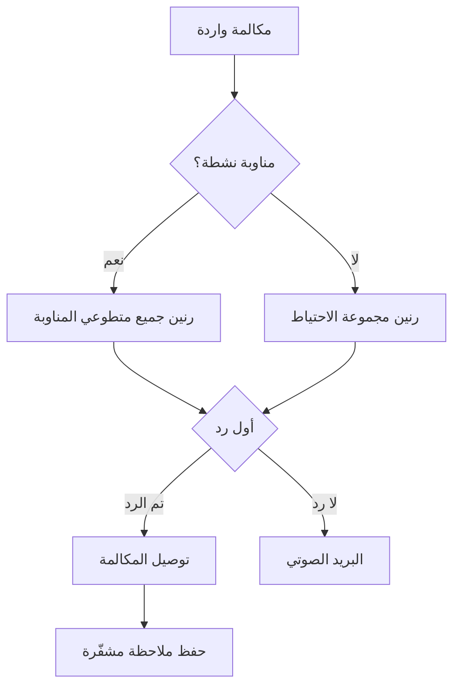

قم بتشغيل خط Llamenos محليًا أو على خادم. كل ما تحتاجه هو Docker — لا حاجة لـ Node.js أو Bun أو أي بيئات تشغيل أخرى.

## كيف يعمل

عندما يتصل شخص ما برقم الخط الساخن، يوجّه Llamenos المكالمة إلى جميع المتطوعين في المناوبة في آن واحد. أول متطوع يرد يتم توصيله، ويتوقف الرنين عند الآخرين. بعد انتهاء المكالمة، يمكن للمتطوع حفظ ملاحظات مشفّرة عن المحادثة.



ينطبق الأمر نفسه على رسائل SMS وWhatsApp وSignal — تظهر في عرض **المحادثات** الموحّد حيث يمكن للمتطوعين الرد.

## المتطلبات المسبقة

- [Docker](https://docs.docker.com/get-docker/) مع Docker Compose v2
- `openssl` (مثبّت مسبقًا في معظم أنظمة Linux وmacOS)
- Git

## البدء السريع

```bash
git clone https://github.com/rhonda-rodododo/llamenos.git
cd llamenos
./scripts/docker-setup.sh
```

يقوم هذا بتوليد جميع المفاتيح السرية المطلوبة، وبناء التطبيق، وتشغيل الخدمات. بمجرد الانتهاء، قم بزيارة **http://localhost:8000** وسيرشدك معالج الإعداد خلال:

1. **إنشاء حساب المسؤول** — يولّد زوج مفاتيح تشفير في متصفحك
2. **تسمية خط الطوارئ** — حدد اسم العرض
3. **اختيار القنوات** — فعّل الصوت، SMS، WhatsApp، Signal، و/أو التقارير
4. **تكوين مزودي الخدمة** — أدخل بيانات الاعتماد لكل قناة مفعّلة
5. **المراجعة والإنهاء**

### تجربة الوضع التجريبي

للاستكشاف مع بيانات نموذجية وتسجيل دخول بنقرة واحدة (بدون الحاجة لإنشاء حساب):

```bash
./scripts/docker-setup.sh --demo
```

## النشر في بيئة الإنتاج

لخادم بنطاق حقيقي وشهادات TLS تلقائية:

```bash
./scripts/docker-setup.sh --domain hotline.yourorg.com --email admin@yourorg.com
```

يقوم Caddy تلقائيًا بتوفير شهادات TLS من Let's Encrypt. تأكد من أن المنفذين 80 و443 مفتوحان. يُفعّل خيار `--domain` طبقة الإنتاج في Docker Compose، التي تضيف TLS وتدوير السجلات وحدود الموارد.

راجع [دليل النشر باستخدام Docker Compose](/docs/deploy-docker) للحصول على تفاصيل كاملة حول تأمين الخادم والنسخ الاحتياطي والمراقبة والخدمات الاختيارية.

## تكوين Webhooks

بعد النشر، وجّه webhooks مزود الاتصالات إلى عنوان URL الخاص بنشرك:

| Webhook | URL |
|---------|-----|
| الصوت (وارد) | `https://your-domain/api/telephony/incoming` |
| الصوت (الحالة) | `https://your-domain/api/telephony/status` |
| SMS | `https://your-domain/api/messaging/sms/webhook` |
| WhatsApp | `https://your-domain/api/messaging/whatsapp/webhook` |
| Signal | قم بتكوين الجسر لإعادة التوجيه إلى `https://your-domain/api/messaging/signal/webhook` |

لإعداد خاص بكل مزود: [Twilio](/docs/setup-twilio)، [SignalWire](/docs/setup-signalwire)، [Vonage](/docs/setup-vonage)، [Plivo](/docs/setup-plivo)، [Asterisk](/docs/setup-asterisk)، [SMS](/docs/setup-sms)، [WhatsApp](/docs/setup-whatsapp)، [Signal](/docs/setup-signal).

## الخطوات التالية

- [النشر باستخدام Docker Compose](/docs/deploy-docker) — دليل النشر الكامل في بيئة الإنتاج مع النسخ الاحتياطي والمراقبة
- [دليل المسؤول](/docs/admin-guide) — إضافة متطوعين وإنشاء مناوبات وتكوين القنوات والإعدادات
- [دليل المتطوع](/docs/volunteer-guide) — شاركه مع متطوعيك
- [دليل المراسل](/docs/reporter-guide) — إعداد دور المراسل لتقديم تقارير مشفّرة
- [مزودو الاتصالات](/docs/telephony-providers) — مقارنة مزودي الصوت
- [نموذج الأمان](/security) — فهم التشفير ونموذج التهديد
