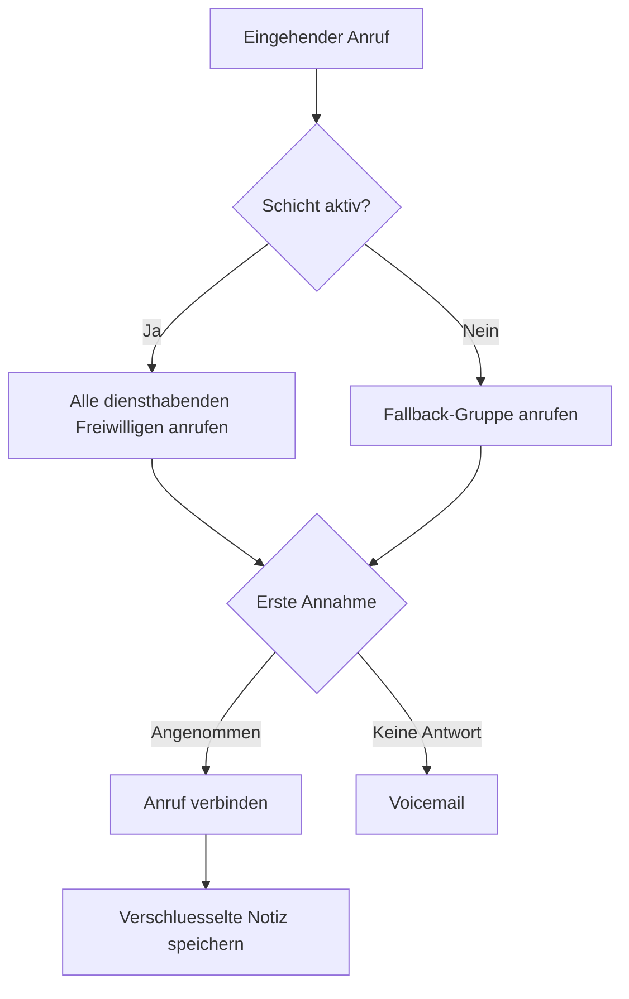

Starten Sie eine Llamenos-Hotline lokal oder auf einem Server. Es wird nur Docker benoetigt — kein Node.js, Bun oder andere Laufzeitumgebungen.

## So funktioniert es

Wenn jemand Ihre Hotline-Nummer anruft, leitet Llamenos den Anruf gleichzeitig an alle diensthabenden Freiwilligen weiter. Der erste Freiwillige, der abnimmt, wird verbunden, und bei den anderen hoert es auf zu klingeln. Nach dem Anruf kann der Freiwillige verschluesselte Notizen zum Gespraech speichern.



Dasselbe gilt fuer SMS-, WhatsApp- und Signal-Nachrichten — sie erscheinen in einer einheitlichen **Konversations**-Ansicht, in der Freiwillige antworten koennen.

## Voraussetzungen

- [Docker](https://docs.docker.com/get-docker/) mit Docker Compose v2
- `openssl` (auf den meisten Linux- und macOS-Systemen vorinstalliert)
- Git

## Schnellstart

```bash
git clone https://github.com/rhonda-rodododo/llamenos.git
cd llamenos
./scripts/docker-setup.sh
```

Dies generiert alle erforderlichen Geheimnisse, baut die Anwendung und startet die Dienste. Besuchen Sie anschliessend **http://localhost:8000** und der Einrichtungsassistent fuehrt Sie durch:

1. **Admin-Konto erstellen** — generiert ein kryptographisches Schluesselpaar in Ihrem Browser
2. **Hotline benennen** — legen Sie den Anzeigenamen fest
3. **Kanaele waehlen** — aktivieren Sie Sprache, SMS, WhatsApp, Signal und/oder Berichte
4. **Anbieter konfigurieren** — geben Sie die Zugangsdaten fuer jeden aktivierten Kanal ein
5. **Ueberpruefen und abschliessen**

### Demo-Modus testen

Zum Erkunden mit vorgegebenen Beispieldaten und Ein-Klick-Anmeldung (keine Kontoerstellung erforderlich):

```bash
./scripts/docker-setup.sh --demo
```

## Produktionsbereitstellung

Fuer einen Server mit eigener Domain und automatischem TLS:

```bash
./scripts/docker-setup.sh --domain hotline.ihreorg.de --email admin@ihreorg.de
```

Caddy stellt automatisch Let's-Encrypt-TLS-Zertifikate bereit. Stellen Sie sicher, dass die Ports 80 und 443 offen sind. Die Option `--domain` aktiviert das Produktions-Overlay von Docker Compose, das TLS, Log-Rotation und Ressourcenlimits hinzufuegt.

Weitere Informationen finden Sie im [Docker-Compose-Bereitstellungsleitfaden](/docs/deploy-docker) mit Details zu Serverhärtung, Backups, Monitoring und optionalen Diensten.

## Webhooks konfigurieren

Richten Sie nach der Bereitstellung die Webhooks Ihres Telefonieanbieter auf Ihre Bereitstellungs-URL:

| Webhook | URL |
|---------|-----|
| Sprache (eingehend) | `https://ihre-domain/api/telephony/incoming` |
| Sprache (Status) | `https://ihre-domain/api/telephony/status` |
| SMS | `https://ihre-domain/api/messaging/sms/webhook` |
| WhatsApp | `https://ihre-domain/api/messaging/whatsapp/webhook` |
| Signal | Konfigurieren Sie die Bridge zur Weiterleitung an `https://ihre-domain/api/messaging/signal/webhook` |

Fuer anbieterspezifische Einrichtung: [Twilio](/docs/setup-twilio), [SignalWire](/docs/setup-signalwire), [Vonage](/docs/setup-vonage), [Plivo](/docs/setup-plivo), [Asterisk](/docs/setup-asterisk), [SMS](/docs/setup-sms), [WhatsApp](/docs/setup-whatsapp), [Signal](/docs/setup-signal).

## Naechste Schritte

- [Docker-Compose-Bereitstellung](/docs/deploy-docker) — vollstaendiger Produktionsleitfaden mit Backups und Monitoring
- [Admin-Leitfaden](/docs/admin-guide) — Freiwillige hinzufuegen, Schichten erstellen, Kanaele und Einstellungen konfigurieren
- [Freiwilligen-Leitfaden](/docs/volunteer-guide) — teilen Sie diesen mit Ihren Freiwilligen
- [Reporter-Leitfaden](/docs/reporter-guide) — richten Sie die Reporter-Rolle fuer verschluesselte Berichtseinreichungen ein
- [Telefonieanbieter](/docs/telephony-providers) — Sprachanbieter vergleichen
- [Sicherheitsmodell](/security) — Verschluesselung und Bedrohungsmodell verstehen
