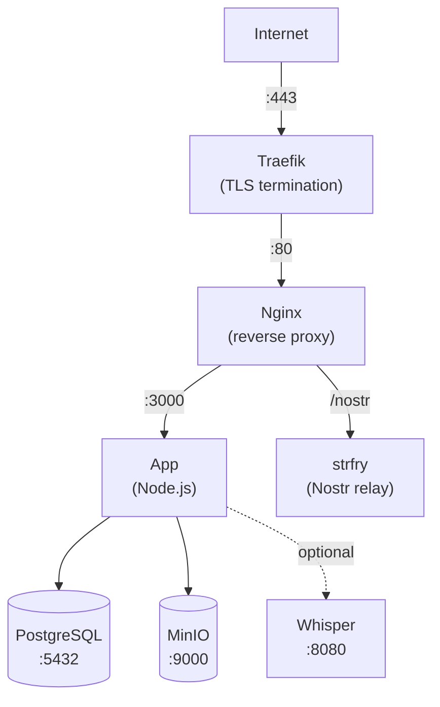

This guide walks you through deploying Llámenos as a [Co-op Cloud](https://coopcloud.tech) recipe. Co-op Cloud uses Docker Swarm with Traefik for TLS termination and the `abra` CLI for standardized app management — ideal for tech co-ops and small hosting collectives.

The recipe is maintained in a [standalone repository](https://github.com/rhonda-rodododo/llamenos-template).

## Prerequisites

- A server with [Docker Swarm](https://docs.docker.com/engine/swarm/) initialized and [Traefik](https://doc.traefik.io/traefik/) running as the reverse proxy
- The [`abra` CLI](https://docs.coopcloud.tech/abra/install/) installed on your local machine
- A domain name with DNS pointing to your server's IP
- SSH access to the server

If you're new to Co-op Cloud, follow the [Co-op Cloud setup guide](https://docs.coopcloud.tech/intro/) first.

## Quick start

```bash
# Add your server (if not already added)
abra server add hotline.example.com

# Clone the recipe (abra looks for recipes in ~/.abra/recipes/)
git clone https://github.com/rhonda-rodododo/llamenos-template.git \
  ~/.abra/recipes/llamenos

# Create a new Llámenos app
abra app new llamenos --server hotline.example.com --domain hotline.example.com

# Generate all secrets
abra app secret generate -a hotline.example.com

# Deploy
abra app deploy hotline.example.com
```

Visit `https://hotline.example.com` and follow the setup wizard to create your admin account.

## Core services

The recipe deploys five services:

| Service | Image | Purpose |
|---------|-------|---------|
| **web** | `nginx:1.27-alpine` | Reverse proxy with Traefik labels |
| **app** | `ghcr.io/rhonda-rodododo/llamenos` | Node.js application server |
| **db** | `postgres:17-alpine` | PostgreSQL database |
| **minio** | `minio/minio` | S3-compatible file storage |
| **relay** | `dockurr/strfry` | Nostr relay for real-time events |

## Secrets

All secrets are managed via Docker Swarm secrets (versioned, immutable):

| Secret | Type | Description |
|--------|------|-------------|
| `hmac_secret` | hex (64 chars) | HMAC signing key for session tokens |
| `server_nostr` | hex (64 chars) | Server Nostr identity key |
| `db_password` | alnum (32 chars) | PostgreSQL password |
| `minio_access` | alnum (20 chars) | MinIO access key |
| `minio_secret` | alnum (40 chars) | MinIO secret key |

Generate all secrets at once:

```bash
abra app secret generate -a hotline.example.com
```

To rotate a specific secret:

```bash
# Bump the version in your app config
abra app config hotline.example.com
# Change SECRET_HMAC_SECRET_VERSION=v2

# Generate the new secret
abra app secret generate hotline.example.com hmac_secret

# Redeploy
abra app deploy hotline.example.com
```

## Configuration

Edit the app configuration:

```bash
abra app config hotline.example.com
```

Key settings:

```env
DOMAIN=hotline.example.com
LETS_ENCRYPT_ENV=production

# Display name shown in the app
HOTLINE_NAME=Hotline

# Telephony provider (configure after setup wizard)
# TWILIO_ACCOUNT_SID=
# TWILIO_AUTH_TOKEN=
# TWILIO_PHONE_NUMBER=
```

## First login

After deployment, open your domain in a browser. The setup wizard guides you through:

1. **Create admin account** — generates a cryptographic keypair in your browser
2. **Name your hotline** — set the display name
3. **Choose channels** — enable Voice, SMS, WhatsApp, Signal, and/or Reports
4. **Configure providers** — enter credentials for each channel
5. **Review and finish**

## Configure webhooks

Point your telephony provider's webhooks to your domain:

- **Voice**: `https://hotline.example.com/telephony/incoming`
- **SMS**: `https://hotline.example.com/api/messaging/sms/webhook`
- **WhatsApp**: `https://hotline.example.com/api/messaging/whatsapp/webhook`
- **Signal**: Configure bridge to forward to `https://hotline.example.com/api/messaging/signal/webhook`

See provider-specific guides: [Twilio](/docs/setup-twilio), [SignalWire](/docs/setup-signalwire), [Vonage](/docs/setup-vonage), [Plivo](/docs/setup-plivo), [Asterisk](/docs/setup-asterisk).

## Optional: Enable transcription

Add the transcription overlay to your app config:

```bash
abra app config hotline.example.com
```

Set:

```env
COMPOSE_FILE=compose.yml:compose.transcription.yml
WHISPER_MODEL=Systran/faster-whisper-base
WHISPER_DEVICE=cpu
```

Then redeploy:

```bash
abra app deploy hotline.example.com
```

The Whisper service requires 4 GB+ RAM. Use `WHISPER_DEVICE=cuda` if you have a GPU.

## Optional: Enable Asterisk

For self-hosted SIP telephony (see [Asterisk setup](/docs/setup-asterisk)):

```bash
abra app config hotline.example.com
```

Set:

```env
COMPOSE_FILE=compose.yml:compose.asterisk.yml
SECRET_ARI_PASSWORD_VERSION=v1
SECRET_BRIDGE_SECRET_VERSION=v1
```

Generate the additional secrets and redeploy:

```bash
abra app secret generate hotline.example.com ari_password bridge_secret
abra app deploy hotline.example.com
```

## Optional: Enable Signal

For Signal messaging (see [Signal setup](/docs/setup-signal)):

```bash
abra app config hotline.example.com
```

Set:

```env
COMPOSE_FILE=compose.yml:compose.signal.yml
```

Then redeploy:

```bash
abra app deploy hotline.example.com
```

## Updating

```bash
abra app upgrade hotline.example.com
```

This pulls the latest recipe version and redeploys. Data is persisted in Docker volumes and survives upgrades.

## Backups

### Backupbot integration

The recipe includes [backupbot](https://docs.coopcloud.tech/backupbot/) labels for automated PostgreSQL and MinIO backups. If your server runs backupbot, backups happen automatically.

### Manual backup

Use the included backup script:

```bash
# From the recipe directory
./pg_backup.sh <stack-name>
./pg_backup.sh <stack-name> /backups    # custom directory, 7-day retention
```

Or back up directly:

```bash
# PostgreSQL
docker exec $(docker ps -q -f name=<stack-name>_db) pg_dump -U llamenos llamenos | gzip > backup.sql.gz

# MinIO
docker run --rm -v <stack-name>_minio-data:/data -v /backups:/backups alpine tar czf /backups/minio-$(date +%Y%m%d).tar.gz /data
```

## Monitoring

### Health checks

All services have Docker health checks. Check status:

```bash
abra app ps hotline.example.com
```

The app exposes `/api/health`:

```bash
curl https://hotline.example.com/api/health
# {"status":"ok"}
```

### Logs

```bash
# All services
abra app logs hotline.example.com

# Specific service
abra app logs hotline.example.com app

# Follow logs
abra app logs -f hotline.example.com app
```

## Troubleshooting

### App won't start

```bash
abra app logs hotline.example.com app
abra app ps hotline.example.com
```

Check that all secrets are generated:

```bash
abra app secret ls hotline.example.com
```

### Certificate issues

Traefik handles TLS. Check Traefik logs on your server:

```bash
docker service logs traefik
```

Ensure your domain's DNS resolves to the server and ports 80/443 are open.

### Secret rotation

If a secret is compromised:

1. Bump the version in app config (e.g., `SECRET_HMAC_SECRET_VERSION=v2`)
2. Generate the new secret: `abra app secret generate hotline.example.com hmac_secret`
3. Redeploy: `abra app deploy hotline.example.com`

## Service architecture



## Next steps

- [Admin Guide](/docs/admin-guide) — configure the hotline
- [Self-Hosting Overview](/docs/self-hosting) — compare deployment options
- [Docker Compose deployment](/docs/deploy-docker) — alternative single-server deployment
- [Recipe repository](https://github.com/rhonda-rodododo/llamenos-template) — Co-op Cloud recipe source
- [Co-op Cloud documentation](https://docs.coopcloud.tech/) — learn more about the platform
