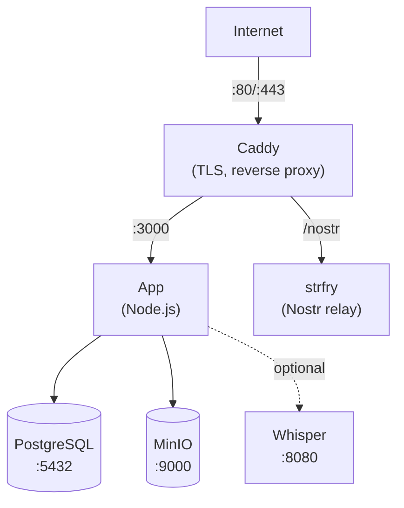

This guide walks you through deploying Llamenos with Docker Compose on a single server. You'll have a fully functional hotline with automatic HTTPS, PostgreSQL database, object storage, real-time relay, and optional transcription — all managed by Docker Compose.

## Prerequisites

- A Linux server (Ubuntu 22.04+, Debian 12+, or similar)
- [Docker Engine](https://docs.docker.com/engine/install/) v24+ with Docker Compose v2
- `openssl` (pre-installed on most systems)
- A domain name with DNS pointing to your server's IP

## Quick start (local)

To try Llamenos locally:

```bash
git clone https://github.com/your-org/llamenos.git
cd llamenos
./scripts/docker-setup.sh
```

Visit **http://localhost** and follow the setup wizard to create your admin account.

## Production deployment

```bash
git clone https://github.com/your-org/llamenos.git
cd llamenos
./scripts/docker-setup.sh --domain hotline.yourorg.com --email admin@yourorg.com
```

The setup script:
1. Generates strong random secrets (database password, HMAC key, MinIO credentials, Nostr relay secret)
2. Writes them to `deploy/docker/.env`
3. Builds and starts all services using the **production Docker Compose overlay** (`docker-compose.production.yml`)
4. Waits for the app to become healthy

The production overlay adds:
- **TLS termination** via Let's Encrypt (Caddy with production Caddyfile)
- **Log rotation** for all services (10 MB max, 5 files)
- **Resource limits** (1 GB memory for the app)
- **Strict CSP** — only `wss://` WebSocket connections (no plain `ws://`)

Visit `https://hotline.yourorg.com` and follow the setup wizard to create your admin account and configure channels.

### Manual setup

If you prefer to configure everything manually instead of using the script:

```bash
cd deploy/docker
cp .env.example .env
```

Edit `.env` and fill in the required secrets. Generate random values:

```bash
# For hex secrets (HMAC_SECRET, SERVER_NOSTR_SECRET):
openssl rand -hex 32

# For passwords (PG_PASSWORD, MINIO_ACCESS_KEY, MINIO_SECRET_KEY):
openssl rand -base64 24
```

Set your domain and email for TLS certificates:

```env
DOMAIN=hotline.yourorg.com
ACME_EMAIL=admin@yourorg.com
```

Then start the services with the production overlay:

```bash
docker compose -f docker-compose.yml -f docker-compose.production.yml up -d
```

## Docker Compose files

| File | Purpose |
|------|---------|
| `docker-compose.yml` | Base configuration — all services, networks, volumes |
| `docker-compose.production.yml` | Production overlay — TLS Caddyfile, log rotation, resource limits |
| `docker-compose.test.yml` | Test overlay — exposes app port, sets development mode |

**Local development** uses only the base file. **Production** stacks the production overlay on top.

## Core services

The setup starts five core services:

| Service | Purpose | Port |
|---------|---------|------|
| **app** | Llamenos application (Node.js) | 3000 (internal) |
| **postgres** | PostgreSQL database | 5432 (internal) |
| **caddy** | Reverse proxy + automatic TLS | 80, 443 |
| **minio** | S3-compatible file storage | 9000, 9001 (internal) |
| **strfry** | Nostr relay for real-time events | 7777 (internal) |

Check that everything is running:

```bash
cd deploy/docker
docker compose -f docker-compose.yml -f docker-compose.production.yml ps
docker compose -f docker-compose.yml -f docker-compose.production.yml logs app --tail 50
```

Verify the health endpoint:

```bash
curl https://hotline.yourorg.com/api/health
# {"status":"ok"}
```

## First login

Open your hotline URL in a browser. The setup wizard will guide you through:

1. **Create admin account** — generates a cryptographic keypair in your browser
2. **Name your hotline** — set the display name
3. **Choose channels** — enable Voice, SMS, WhatsApp, Signal, and/or Reports
4. **Configure providers** — enter credentials for each channel
5. **Review and finish**

## Configure webhooks

Point your telephony provider's webhooks to your domain:

- **Voice**: `https://hotline.yourorg.com/telephony/incoming`
- **SMS**: `https://hotline.yourorg.com/api/messaging/sms/webhook`
- **WhatsApp**: `https://hotline.yourorg.com/api/messaging/whatsapp/webhook`
- **Signal**: Configure bridge to forward to `https://hotline.yourorg.com/api/messaging/signal/webhook`

See provider-specific guides: [Twilio](/docs/setup-twilio), [SignalWire](/docs/setup-signalwire), [Vonage](/docs/setup-vonage), [Plivo](/docs/setup-plivo), [Asterisk](/docs/setup-asterisk).

## Optional: Enable transcription

The Whisper transcription service requires additional RAM (4 GB+):

```bash
docker compose -f docker-compose.yml -f docker-compose.production.yml --profile transcription up -d
```

Configure the model in your `.env`:

```env
WHISPER_MODEL=Systran/faster-whisper-base   # or small, medium, large
WHISPER_DEVICE=cpu                           # or cuda for GPU
```

## Optional: Enable Asterisk

For self-hosted SIP telephony (see [Asterisk setup](/docs/setup-asterisk)):

```bash
# Add credentials to .env first
echo "ARI_PASSWORD=$(openssl rand -base64 24)" >> deploy/docker/.env
echo "BRIDGE_SECRET=$(openssl rand -hex 32)" >> deploy/docker/.env

docker compose -f docker-compose.yml -f docker-compose.production.yml --profile asterisk up -d
```

## Optional: Enable Signal

For Signal messaging (see [Signal setup](/docs/setup-signal)):

```bash
docker compose -f docker-compose.yml -f docker-compose.production.yml --profile signal up -d
```

## Updating

Pull the latest code and rebuild:

```bash
cd /path/to/llamenos/deploy/docker
git -C ../.. pull
docker compose -f docker-compose.yml -f docker-compose.production.yml build
docker compose -f docker-compose.yml -f docker-compose.production.yml up -d
```

Data is persisted in Docker volumes (`postgres-data`, `minio-data`, etc.) and survives container restarts and rebuilds.

## Backups

### PostgreSQL

```bash
docker compose -f docker-compose.yml -f docker-compose.production.yml exec postgres pg_dump -U llamenos llamenos > backup-$(date +%Y%m%d).sql
```

To restore:

```bash
docker compose -f docker-compose.yml -f docker-compose.production.yml exec -T postgres psql -U llamenos llamenos < backup-20250101.sql
```

### MinIO storage

MinIO stores uploaded files, recordings, and attachments:

```bash
docker compose exec minio mc alias set local http://localhost:9000 $MINIO_ACCESS_KEY $MINIO_SECRET_KEY
docker compose exec minio mc mirror local/llamenos /tmp/minio-backup
```

### Automated backups

For production, set up a cron job:

```bash
# /etc/cron.d/llamenos-backup
0 3 * * * root cd /opt/llamenos/deploy/docker && docker compose -f docker-compose.yml -f docker-compose.production.yml exec -T postgres pg_dump -U llamenos llamenos | gzip > /backups/llamenos-$(date +\%Y\%m\%d).sql.gz 2>&1 | logger -t llamenos-backup
```

## Monitoring

### Health checks

The app exposes `/api/health`. Docker Compose has built-in health checks for all services. Monitor externally with any HTTP uptime checker.

### Logs

```bash
cd /opt/llamenos/deploy/docker

# All services
docker compose -f docker-compose.yml -f docker-compose.production.yml logs -f

# Specific service
docker compose -f docker-compose.yml -f docker-compose.production.yml logs -f app

# Last 100 lines
docker compose -f docker-compose.yml -f docker-compose.production.yml logs --tail 100 app
```

## Troubleshooting

### App won't start

```bash
docker compose -f docker-compose.yml -f docker-compose.production.yml logs app
docker compose -f docker-compose.yml -f docker-compose.production.yml config  # verify .env is loaded
docker compose -f docker-compose.yml -f docker-compose.production.yml ps       # check service health
```

### Certificate issues

Caddy needs ports 80 and 443 open for ACME challenges:

```bash
docker compose -f docker-compose.yml -f docker-compose.production.yml logs caddy
curl -I http://hotline.yourorg.com
```

## Service architecture



## Next steps

- [Admin Guide](/docs/admin-guide) — configure the hotline
- [Self-Hosting Overview](/docs/self-hosting) — compare deployment options
- [Kubernetes Deployment](/docs/deploy-kubernetes) — migrate to Helm
- [QUICKSTART.md](https://github.com/your-org/llamenos/blob/main/docs/QUICKSTART.md) — VPS provisioning and server hardening
