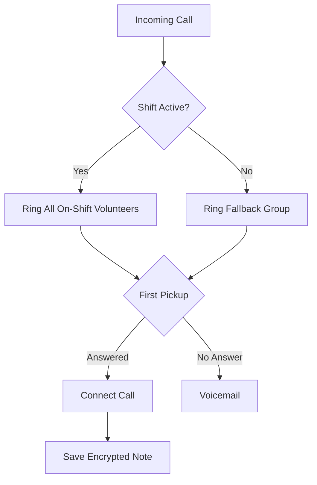

Get a Llamenos hotline running locally or on a server. Only Docker is required — no Node.js, Bun, or other runtimes needed.

## How it works

When someone calls your hotline number, Llamenos routes the call to all on-shift volunteers simultaneously. The first volunteer to answer gets connected, and the others stop ringing. After the call ends, the volunteer can save encrypted notes about the conversation.



The same routing applies to SMS, WhatsApp, and Signal messages — they appear in a unified **Conversations** view where volunteers can respond.

## Prerequisites

- [Docker](https://docs.docker.com/get-docker/) with Docker Compose v2
- `openssl` (pre-installed on most Linux and macOS systems)
- Git

## Quick start

```bash
git clone https://github.com/rhonda-rodododo/llamenos.git
cd llamenos
./scripts/docker-setup.sh
```

This generates all required secrets, builds the application, and starts the services. Once complete, visit **http://localhost:8000** and the setup wizard will guide you through:

1. **Create your admin account** — you'll receive an invite link from your organization's identity provider (Authentik). Click the link, set up your credentials, and your admin account is provisioned automatically.
2. **Name your hotline** — set the display name
3. **Choose channels** — enable Voice, SMS, WhatsApp, Signal, and/or Reports
4. **Configure providers** — enter credentials for each enabled channel
5. **Review and finish**

### Try demo mode

To explore with pre-seeded sample data and one-click login (no account creation needed):

```bash
./scripts/docker-setup.sh --demo
```

## Production deployment

For a server with a real domain and automatic TLS:

```bash
./scripts/docker-setup.sh --domain hotline.yourorg.com --email admin@yourorg.com
```

Caddy automatically provisions Let's Encrypt TLS certificates. Make sure ports 80 and 443 are open. The `--domain` flag activates the production Docker Compose overlay, which adds TLS, log rotation, and resource limits.

See the [Docker Compose deployment guide](/docs/deploy/docker) for full details on server hardening, backups, monitoring, and optional services.

## Core services

The Docker setup starts six core services:

| Service | Purpose | Port |
|---------|---------|------|
| **app** | Llamenos application (Bun) | 3000 (internal) |
| **postgres** | PostgreSQL database | 5432 (internal) |
| **caddy** | Reverse proxy + automatic TLS | 8000 (local), 80/443 (production) |
| **rustfs** | S3-compatible file storage (RustFS) | 9000 (internal) |
| **strfry** | Nostr relay for real-time events | 7777 (internal) |
| **authentik** | Identity provider (SSO, invite-based onboarding) | 9443 (internal) |

## Configure webhooks

After deploying, point your telephony provider's webhooks to your deployment URL:

| Webhook | URL |
|---------|-----|
| Voice (incoming) | `https://your-domain/api/telephony/incoming` |
| Voice (status) | `https://your-domain/api/telephony/status` |
| SMS | `https://your-domain/api/messaging/sms/webhook` |
| WhatsApp | `https://your-domain/api/messaging/whatsapp/webhook` |
| Signal | Configure bridge to forward to `https://your-domain/api/messaging/signal/webhook` |

For provider-specific setup: [Twilio](/docs/deploy/providers/twilio), [SignalWire](/docs/deploy/providers/signalwire), [Vonage](/docs/deploy/providers/vonage), [Plivo](/docs/deploy/providers/plivo), [Asterisk](/docs/deploy/providers/asterisk), [SMS](/docs/deploy/providers/sms), [WhatsApp](/docs/deploy/providers/whatsapp), [Signal](/docs/deploy/providers/signal).

## Next steps

- [Docker Compose Deployment](/docs/deploy/docker) — full production deployment guide with backups and monitoring
- [Admin Guide](/docs/guides/?audience=operator) — add volunteers, create shifts, configure channels and settings
- [Volunteer Guide](/docs/guides/?audience=staff) — share with your volunteers
- [Telephony Providers](/docs/deploy/providers/) — compare voice providers
- [Security Model](/security) — understand the encryption and threat model
