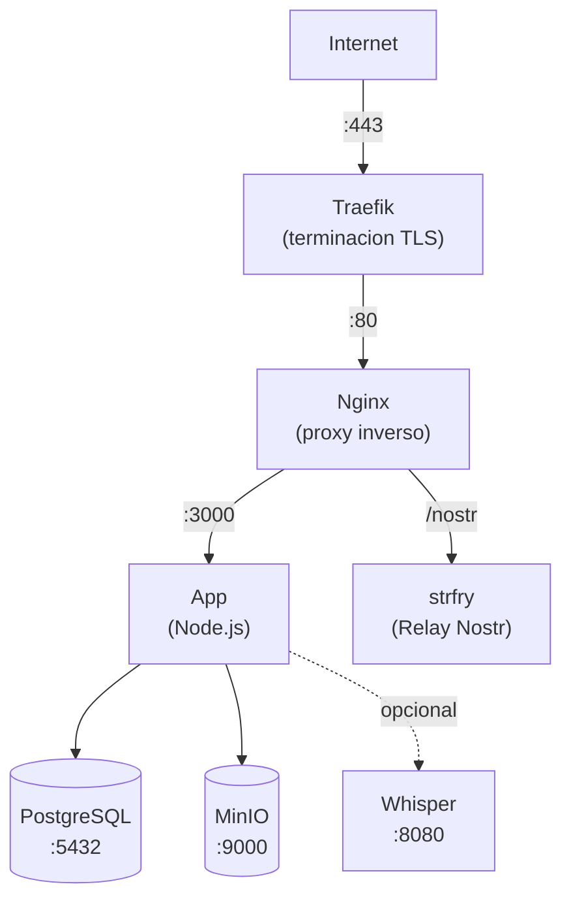

Esta guia te lleva paso a paso por el despliegue de Llamenos como una receta de [Co-op Cloud](https://coopcloud.tech). Co-op Cloud usa Docker Swarm con Traefik para terminacion TLS y el CLI `abra` para gestion estandarizada de aplicaciones — ideal para cooperativas tecnologicas y pequenos colectivos de hospedaje.

La receta se mantiene en un [repositorio independiente](https://github.com/rhonda-rodododo/llamenos-template), publicado automaticamente desde el repositorio principal de Llamenos en cada version. La fuente de verdad vive en `deploy/coopcloud/` en el [repositorio principal](https://github.com/rhonda-rodododo/llamenos).

## Requisitos previos

- Un servidor con [Docker Swarm](https://docs.docker.com/engine/swarm/) inicializado y [Traefik](https://doc.traefik.io/traefik/) ejecutandose como proxy inverso
- El [CLI `abra`](https://docs.coopcloud.tech/abra/install/) instalado en tu maquina local
- Un nombre de dominio con DNS apuntando a la IP de tu servidor
- Acceso SSH al servidor

Si eres nuevo en Co-op Cloud, sigue primero la [guia de configuracion de Co-op Cloud](https://docs.coopcloud.tech/intro/).

## Inicio rapido

```bash
# Agrega tu servidor (si no lo has hecho)
abra server add hotline.ejemplo.com

# Clona la receta (abra busca recetas en ~/.abra/recipes/)
git clone https://github.com/rhonda-rodododo/llamenos-template.git \
  ~/.abra/recipes/llamenos

# Crea una nueva app de Llamenos
abra app new llamenos --server hotline.ejemplo.com --domain hotline.ejemplo.com

# Genera todos los secretos
abra app secret generate -a hotline.ejemplo.com

# Despliega
abra app deploy hotline.ejemplo.com
```

Visita `https://hotline.ejemplo.com` y sigue el asistente de configuracion para crear tu cuenta de administrador.

## Servicios principales

La receta despliega cinco servicios:

| Servicio | Imagen | Proposito |
|----------|--------|-----------|
| **web** | `nginx:1.27-alpine` | Proxy inverso con etiquetas Traefik |
| **app** | `ghcr.io/rhonda-rodododo/llamenos` | Servidor de aplicacion Node.js |
| **db** | `postgres:17-alpine` | Base de datos PostgreSQL |
| **minio** | `minio/minio` | Almacenamiento de archivos compatible con S3 |
| **relay** | `dockurr/strfry` | Relay Nostr para eventos en tiempo real |

## Secretos

Todos los secretos se gestionan via secretos de Docker Swarm (versionados, inmutables):

| Secreto | Tipo | Descripcion |
|---------|------|-------------|
| `hmac_secret` | hex (64 chars) | Clave HMAC para firmar tokens de sesion |
| `server_nostr` | hex (64 chars) | Clave de identidad Nostr del servidor |
| `db_password` | alfanum (32 chars) | Contrasena de PostgreSQL |
| `minio_access` | alfanum (20 chars) | Clave de acceso MinIO |
| `minio_secret` | alfanum (40 chars) | Clave secreta MinIO |

Genera todos los secretos de una vez:

```bash
abra app secret generate -a hotline.ejemplo.com
```

Para rotar un secreto especifico:

```bash
# Incrementa la version en tu configuracion
abra app config hotline.ejemplo.com
# Cambia SECRET_HMAC_SECRET_VERSION=v2

# Genera el nuevo secreto
abra app secret generate hotline.ejemplo.com hmac_secret

# Redespliega
abra app deploy hotline.ejemplo.com
```

## Configuracion

Edita la configuracion de la app:

```bash
abra app config hotline.ejemplo.com
```

Configuraciones clave:

```env
DOMAIN=hotline.ejemplo.com
LETS_ENCRYPT_ENV=production

# Nombre mostrado en la app
HOTLINE_NAME=Linea de ayuda

# Proveedor de telefonia (configurar despues del asistente)
# TWILIO_ACCOUNT_SID=
# TWILIO_AUTH_TOKEN=
# TWILIO_PHONE_NUMBER=
```

## Primer inicio de sesion

Despues del despliegue, abre tu dominio en un navegador. El asistente de configuracion te guia a traves de:

1. **Crear cuenta de administrador** — genera un par de claves criptograficas en tu navegador
2. **Nombrar tu linea** — establece el nombre visible
3. **Elegir canales** — habilita Voz, SMS, WhatsApp, Signal y/o Reportes
4. **Configurar proveedores** — ingresa credenciales para cada canal
5. **Revisar y finalizar**

## Configurar webhooks

Apunta los webhooks de tu proveedor de telefonia a tu dominio:

- **Voz**: `https://hotline.ejemplo.com/telephony/incoming`
- **SMS**: `https://hotline.ejemplo.com/api/messaging/sms/webhook`
- **WhatsApp**: `https://hotline.ejemplo.com/api/messaging/whatsapp/webhook`
- **Signal**: Configura el bridge para reenviar a `https://hotline.ejemplo.com/api/messaging/signal/webhook`

Consulta las guias por proveedor: [Twilio](/docs/setup-twilio), [SignalWire](/docs/setup-signalwire), [Vonage](/docs/setup-vonage), [Plivo](/docs/setup-plivo), [Asterisk](/docs/setup-asterisk).

## Opcional: Habilitar transcripcion

Agrega la capa de transcripcion a tu configuracion:

```bash
abra app config hotline.ejemplo.com
```

Establece:

```env
COMPOSE_FILE=compose.yml:compose.transcription.yml
WHISPER_MODEL=Systran/faster-whisper-base
WHISPER_DEVICE=cpu
```

Luego redespliega:

```bash
abra app deploy hotline.ejemplo.com
```

El servicio Whisper requiere 4 GB+ de RAM. Usa `WHISPER_DEVICE=cuda` si tienes una GPU.

## Opcional: Habilitar Asterisk

Para telefonia SIP autoalojada (ver [configuracion de Asterisk](/docs/setup-asterisk)):

```bash
abra app config hotline.ejemplo.com
```

Establece:

```env
COMPOSE_FILE=compose.yml:compose.asterisk.yml
SECRET_ARI_PASSWORD_VERSION=v1
SECRET_BRIDGE_SECRET_VERSION=v1
```

Genera los secretos adicionales y redespliega:

```bash
abra app secret generate hotline.ejemplo.com ari_password bridge_secret
abra app deploy hotline.ejemplo.com
```

## Opcional: Habilitar Signal

Para mensajeria Signal (ver [configuracion de Signal](/docs/setup-signal)):

```bash
abra app config hotline.ejemplo.com
```

Establece:

```env
COMPOSE_FILE=compose.yml:compose.signal.yml
```

Luego redespliega:

```bash
abra app deploy hotline.ejemplo.com
```

## Actualizacion

```bash
abra app upgrade hotline.ejemplo.com
```

Esto descarga la ultima version de la receta y redespliega. Los datos se persisten en volumenes Docker y sobreviven a las actualizaciones.

## Respaldos

### Integracion con backupbot

La receta incluye etiquetas de [backupbot](https://docs.coopcloud.tech/backupbot/) para respaldos automaticos de PostgreSQL y MinIO. Si tu servidor ejecuta backupbot, los respaldos ocurren automaticamente.

### Respaldo manual

Usa el script incluido:

```bash
# Desde el directorio de la receta
./pg_backup.sh <nombre-del-stack>
./pg_backup.sh <nombre-del-stack> /backups    # directorio personalizado, retencion de 7 dias
```

O respalda directamente:

```bash
# PostgreSQL
docker exec $(docker ps -q -f name=<nombre-del-stack>_db) pg_dump -U llamenos llamenos | gzip > backup.sql.gz

# MinIO
docker run --rm -v <nombre-del-stack>_minio-data:/data -v /backups:/backups alpine tar czf /backups/minio-$(date +%Y%m%d).tar.gz /data
```

## Monitoreo

### Verificaciones de salud

Todos los servicios tienen verificaciones de salud de Docker. Consulta el estado:

```bash
abra app ps hotline.ejemplo.com
```

La app expone `/api/health`:

```bash
curl https://hotline.ejemplo.com/api/health
# {"status":"ok"}
```

### Logs

```bash
# Todos los servicios
abra app logs hotline.ejemplo.com

# Servicio especifico
abra app logs hotline.ejemplo.com app

# Seguir los logs
abra app logs -f hotline.ejemplo.com app
```

## Solucion de problemas

### La app no inicia

```bash
abra app logs hotline.ejemplo.com app
abra app ps hotline.ejemplo.com
```

Verifica que todos los secretos esten generados:

```bash
abra app secret ls hotline.ejemplo.com
```

### Problemas con certificados

Traefik maneja TLS. Revisa los logs de Traefik en tu servidor:

```bash
docker service logs traefik
```

Asegurate de que el DNS de tu dominio resuelva al servidor y que los puertos 80/443 esten abiertos.

### Rotacion de secretos

Si un secreto se ve comprometido:

1. Incrementa la version en la configuracion (ej., `SECRET_HMAC_SECRET_VERSION=v2`)
2. Genera el nuevo secreto: `abra app secret generate hotline.ejemplo.com hmac_secret`
3. Redespliega: `abra app deploy hotline.ejemplo.com`

## Arquitectura de servicios



## Siguientes pasos

- [Guia de Administrador](/docs/admin-guide) — configura la linea
- [Autoalojamiento](/docs/self-hosting) — compara opciones de despliegue
- [Despliegue con Docker Compose](/docs/deploy-docker) — despliegue alternativo en servidor unico
- [Repositorio de la receta](https://github.com/rhonda-rodododo/llamenos-template) — fuente de la receta Co-op Cloud
- [Documentacion de Co-op Cloud](https://docs.coopcloud.tech/) — aprende mas sobre la plataforma
