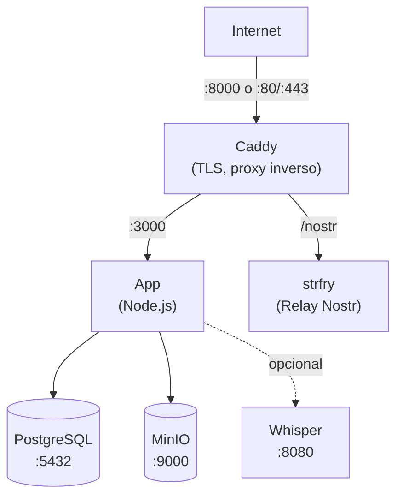

Esta guia te lleva paso a paso a traves del despliegue de Llamenos con Docker Compose en un solo servidor. Tendras una linea de ayuda completamente funcional con HTTPS automatico, base de datos PostgreSQL, almacenamiento de objetos, relay de tiempo real y transcripcion opcional — todo gestionado por Docker Compose.

## Requisitos previos

- Un servidor Linux (Ubuntu 22.04+, Debian 12+ o similar)
- [Docker Engine](https://docs.docker.com/engine/install/) v24+ con Docker Compose v2
- `openssl` (preinstalado en la mayoria de sistemas)
- Un nombre de dominio con DNS apuntando a la IP de tu servidor

## Inicio rapido (local)

Para probar Llamenos localmente:

```bash
git clone https://github.com/your-org/llamenos.git
cd llamenos
./scripts/docker-setup.sh
```

Visita **http://localhost:8000** y sigue el asistente de configuracion para crear tu cuenta de administrador.

## Despliegue en produccion

```bash
git clone https://github.com/your-org/llamenos.git
cd llamenos
./scripts/docker-setup.sh --domain linea.tuorg.com --email admin@tuorg.com
```

El script de configuracion:
1. Genera secretos aleatorios fuertes (contrasena de base de datos, clave HMAC, credenciales MinIO, secreto del relay Nostr)
2. Los escribe en `deploy/docker/.env`
3. Construye e inicia todos los servicios usando la **capa de produccion de Docker Compose** (`docker-compose.production.yml`)
4. Espera a que la aplicacion este saludable

La capa de produccion agrega:
- **Terminacion TLS** via Let's Encrypt (Caddy con Caddyfile de produccion)
- **Rotacion de logs** para todos los servicios (10 MB max, 5 archivos)
- **Limites de recursos** (1 GB de memoria para la app)
- **CSP estricto** — solo conexiones WebSocket `wss://` (sin `ws://` plano)

Visita `https://linea.tuorg.com` y sigue el asistente de configuracion para crear tu cuenta de administrador y configurar los canales.

### Configuracion manual

Si prefieres configurar todo manualmente en lugar de usar el script:

```bash
cd deploy/docker
cp .env.example .env
```

Edita `.env` y llena los secretos requeridos. Genera valores aleatorios:

```bash
# Para secretos hex (HMAC_SECRET, SERVER_NOSTR_SECRET):
openssl rand -hex 32

# Para contrasenas (PG_PASSWORD, MINIO_ACCESS_KEY, MINIO_SECRET_KEY):
openssl rand -base64 24
```

Configura tu dominio y email para certificados TLS:

```env
DOMAIN=linea.tuorg.com
ACME_EMAIL=admin@tuorg.com
```

Luego inicia los servicios con la capa de produccion:

```bash
docker compose -f docker-compose.yml -f docker-compose.production.yml up -d
```

## Archivos de Docker Compose

| Archivo | Proposito |
|---------|-----------|
| `docker-compose.yml` | Configuracion base — todos los servicios, redes, volumenes |
| `docker-compose.production.yml` | Capa de produccion — Caddyfile con TLS, rotacion de logs, limites de recursos |
| `docker-compose.test.yml` | Capa de pruebas — expone puerto de la app, modo desarrollo |

**Desarrollo local** usa solo el archivo base. **Produccion** agrega la capa de produccion.

## Servicios principales

La configuracion inicia cinco servicios principales:

| Servicio | Proposito | Puerto |
|----------|-----------|--------|
| **app** | Aplicacion Llamenos (Node.js) | 3000 (interno) |
| **postgres** | Base de datos PostgreSQL | 5432 (interno) |
| **caddy** | Proxy inverso + TLS automatico | 8000 (local), 80/443 (produccion) |
| **minio** | Almacenamiento de archivos compatible con S3 | 9000, 9001 (interno) |
| **strfry** | Relay Nostr para eventos en tiempo real | 7777 (interno) |

Verifica que todo este funcionando:

```bash
cd deploy/docker
docker compose -f docker-compose.yml -f docker-compose.production.yml ps
docker compose -f docker-compose.yml -f docker-compose.production.yml logs app --tail 50
```

Verifica el endpoint de salud:

```bash
curl https://linea.tuorg.com/api/health
# {"status":"ok"}
```

## Primer inicio de sesion

Abre la URL de tu linea en un navegador. El asistente de configuracion te guiara para:

1. **Crear cuenta admin** — genera un par de claves criptograficas en tu navegador
2. **Nombrar tu linea** — establece el nombre para mostrar
3. **Elegir canales** — habilita Voz, SMS, WhatsApp, Signal y/o Reportes
4. **Configurar proveedores** — ingresa credenciales para cada canal
5. **Revisar y finalizar**

## Configurar webhooks

Apunta los webhooks de tu proveedor de telefonia a tu dominio:

- **Voz**: `https://linea.tuorg.com/telephony/incoming`
- **SMS**: `https://linea.tuorg.com/api/messaging/sms/webhook`
- **WhatsApp**: `https://linea.tuorg.com/api/messaging/whatsapp/webhook`
- **Signal**: Configura el bridge para reenviar a `https://linea.tuorg.com/api/messaging/signal/webhook`

Consulta las guias especificas: [Twilio](/docs/setup-twilio), [SignalWire](/docs/setup-signalwire), [Vonage](/docs/setup-vonage), [Plivo](/docs/setup-plivo), [Asterisk](/docs/setup-asterisk).

## Opcional: Habilitar transcripcion

El servicio de transcripcion Whisper requiere RAM adicional (4 GB+):

```bash
docker compose -f docker-compose.yml -f docker-compose.production.yml --profile transcription up -d
```

Configura el modelo en tu `.env`:

```env
WHISPER_MODEL=Systran/faster-whisper-base   # o small, medium, large
WHISPER_DEVICE=cpu                           # o cuda para GPU
```

## Opcional: Habilitar Asterisk

Para telefonia SIP autoalojada (ver [configuracion de Asterisk](/docs/setup-asterisk)):

```bash
echo "ARI_PASSWORD=$(openssl rand -base64 24)" >> deploy/docker/.env
echo "BRIDGE_SECRET=$(openssl rand -hex 32)" >> deploy/docker/.env

docker compose -f docker-compose.yml -f docker-compose.production.yml --profile asterisk up -d
```

## Opcional: Habilitar Signal

Para mensajeria Signal (ver [configuracion de Signal](/docs/setup-signal)):

```bash
docker compose -f docker-compose.yml -f docker-compose.production.yml --profile signal up -d
```

## Actualizacion

Descarga el codigo mas reciente y reconstruye:

```bash
cd /path/to/llamenos/deploy/docker
git -C ../.. pull
docker compose -f docker-compose.yml -f docker-compose.production.yml build
docker compose -f docker-compose.yml -f docker-compose.production.yml up -d
```

Los datos se mantienen en volumenes Docker (`postgres-data`, `minio-data`, etc.) y sobreviven a reinicios y reconstrucciones.

## Respaldos

### PostgreSQL

```bash
docker compose -f docker-compose.yml -f docker-compose.production.yml exec postgres pg_dump -U llamenos llamenos > backup-$(date +%Y%m%d).sql
```

Para restaurar:

```bash
docker compose -f docker-compose.yml -f docker-compose.production.yml exec -T postgres psql -U llamenos llamenos < backup-20250101.sql
```

### Almacenamiento MinIO

```bash
docker compose exec minio mc alias set local http://localhost:9000 $MINIO_ACCESS_KEY $MINIO_SECRET_KEY
docker compose exec minio mc mirror local/llamenos /tmp/minio-backup
```

### Respaldos automatizados

Para produccion, configura un cron job:

```bash
# /etc/cron.d/llamenos-backup
0 3 * * * root cd /opt/llamenos/deploy/docker && docker compose -f docker-compose.yml -f docker-compose.production.yml exec -T postgres pg_dump -U llamenos llamenos | gzip > /backups/llamenos-$(date +\%Y\%m\%d).sql.gz 2>&1 | logger -t llamenos-backup
```

## Monitoreo

### Verificaciones de salud

La app expone `/api/health`. Docker Compose tiene health checks integrados. Monitorea externamente con cualquier verificador HTTP.

### Logs

```bash
cd /opt/llamenos/deploy/docker

# Todos los servicios
docker compose -f docker-compose.yml -f docker-compose.production.yml logs -f

# Servicio especifico
docker compose -f docker-compose.yml -f docker-compose.production.yml logs -f app

# Ultimas 100 lineas
docker compose -f docker-compose.yml -f docker-compose.production.yml logs --tail 100 app
```

## Solucion de problemas

### La app no inicia

```bash
docker compose -f docker-compose.yml -f docker-compose.production.yml logs app
docker compose -f docker-compose.yml -f docker-compose.production.yml config
docker compose -f docker-compose.yml -f docker-compose.production.yml ps
```

### Problemas con certificados

Caddy necesita los puertos 80 y 443 abiertos para los desafios ACME:

```bash
docker compose -f docker-compose.yml -f docker-compose.production.yml logs caddy
curl -I http://linea.tuorg.com
```

## Arquitectura del servicio



## Siguientes pasos

- [Guia del Administrador](/docs/admin-guide) — configura la linea
- [Autoalojamiento](/docs/self-hosting) — compara opciones de despliegue
- [Despliegue en Kubernetes](/docs/deploy-kubernetes) — migra a Helm
