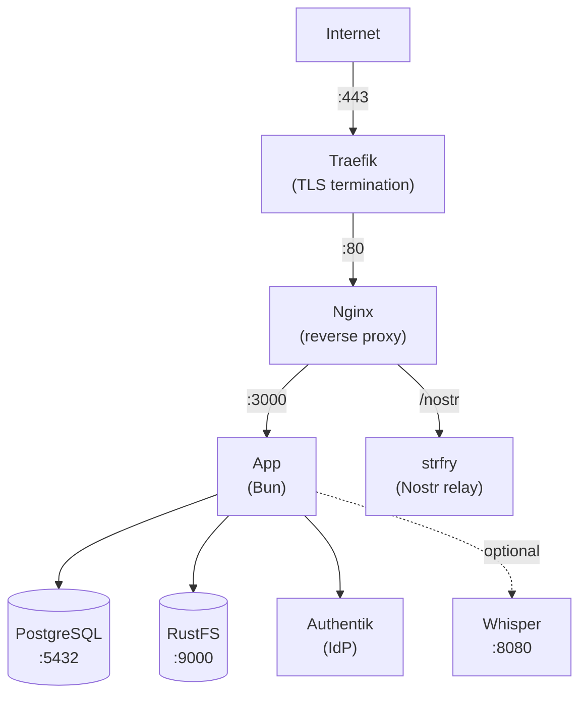

Esta guia te lleva paso a paso por el despliegue de Llamenos como una receta de [Co-op Cloud](https://coopcloud.tech). Co-op Cloud usa Docker Swarm con Traefik para la terminacion TLS y el CLI `abra` para la gestion estandarizada de aplicaciones — ideal para cooperativas tecnologicas y pequenos colectivos de alojamiento.

La receta se mantiene en un [repositorio independiente](https://github.com/rhonda-rodododo/llamenos-template).

## Requisitos previos

- Un servidor con [Docker Swarm](https://docs.docker.com/engine/swarm/) inicializado y [Traefik](https://doc.traefik.io/traefik/) ejecutandose como proxy inverso
- El [CLI `abra`](https://docs.coopcloud.tech/abra/install/) instalado en tu maquina local
- Un nombre de dominio con DNS apuntando a la IP de tu servidor
- Acceso SSH al servidor

Si eres nuevo en Co-op Cloud, sigue primero la [guia de configuracion de Co-op Cloud](https://docs.coopcloud.tech/intro/).

## Inicio rapido

```bash
# Agrega tu servidor (si no lo has agregado aun)
abra server add hotline.example.com

# Clona la receta (abra busca recetas en ~/.abra/recipes/)
git clone https://github.com/rhonda-rodododo/llamenos-template.git \
  ~/.abra/recipes/llamenos

# Crea una nueva aplicacion Llamenos
abra app new llamenos --server hotline.example.com --domain hotline.example.com

# Genera todos los secretos
abra app secret generate -a hotline.example.com

# Despliega
abra app deploy hotline.example.com
```

Visita `https://hotline.example.com` y sigue el asistente de configuracion para crear tu cuenta de administrador.

## Servicios principales

La receta despliega seis servicios:

| Servicio | Imagen | Proposito |
|----------|--------|-----------|
| **web** | `nginx:1.27-alpine` | Proxy inverso con etiquetas de Traefik |
| **app** | `ghcr.io/rhonda-rodododo/llamenos` | Servidor de aplicacion Bun |
| **db** | `postgres:17-alpine` | Base de datos PostgreSQL |
| **rustfs** | `ghcr.io/rustfs/rustfs` | Almacenamiento de archivos compatible con S3 |
| **relay** | `dockurr/strfry` | Relay Nostr para eventos en tiempo real |
| **authentik** | `ghcr.io/goauthentik/server` | Proveedor de identidad (SSO, incorporacion por invitacion) |

## Secretos

Todos los secretos se gestionan mediante secretos de Docker Swarm (versionados, inmutables):

| Secreto | Tipo | Descripcion |
|---------|------|-------------|
| `hmac_secret` | hex (64 caracteres) | Clave de firma HMAC para tokens de sesion |
| `server_nostr` | hex (64 caracteres) | Clave de identidad Nostr del servidor |
| `db_password` | alfanumerico (32 caracteres) | Contrasena de PostgreSQL |
| `rustfs_access` | alfanumerico (20 caracteres) | Clave de acceso de RustFS |
| `rustfs_secret` | alfanumerico (40 caracteres) | Clave secreta de RustFS |
| `authentik_secret` | alfanumerico (50 caracteres) | Clave secreta de Authentik |

Genera todos los secretos de una vez:

```bash
abra app secret generate -a hotline.example.com
```

Para rotar un secreto especifico:

```bash
# Incrementa la version en la configuracion de tu aplicacion
abra app config hotline.example.com
# Cambia SECRET_HMAC_SECRET_VERSION=v2

# Genera el nuevo secreto
abra app secret generate hotline.example.com hmac_secret

# Redesplega
abra app deploy hotline.example.com
```

## Configuracion

Edita la configuracion de la aplicacion:

```bash
abra app config hotline.example.com
```

Ajustes clave:

```env
DOMAIN=hotline.example.com
LETS_ENCRYPT_ENV=production

# Nombre visible en la aplicacion
HOTLINE_NAME=Hotline

# Proveedor de telefonia (configurar despues del asistente de configuracion)
# TWILIO_ACCOUNT_SID=
# TWILIO_AUTH_TOKEN=
# TWILIO_PHONE_NUMBER=
```

## Primer inicio de sesion

Despues del despliegue, abre tu dominio en un navegador. Seras redirigido a Authentik para crear tu cuenta de administrador mediante un enlace de invitacion, y luego completaras el asistente de configuracion:

1. **Nombra tu linea de ayuda** — establece el nombre visible
2. **Elige los canales** — activa Voz, SMS, WhatsApp, Signal y/o Reportes
3. **Configura los proveedores** — ingresa las credenciales de cada canal
4. **Revisa y finaliza**

## Configurar webhooks

Apunta los webhooks de tu proveedor de telefonia a tu dominio:

- **Voz (entrante)**: `https://hotline.example.com/api/telephony/incoming`
- **Voz (estado)**: `https://hotline.example.com/api/telephony/status`
- **SMS**: `https://hotline.example.com/api/messaging/sms/webhook`
- **WhatsApp**: `https://hotline.example.com/api/messaging/whatsapp/webhook`
- **Signal**: Configura el puente para reenviar a `https://hotline.example.com/api/messaging/signal/webhook`

Consulta las guias especificas por proveedor: [Twilio](/docs/deploy/providers/twilio), [SignalWire](/docs/deploy/providers/signalwire), [Vonage](/docs/deploy/providers/vonage), [Plivo](/docs/deploy/providers/plivo), [Asterisk](/docs/deploy/providers/asterisk).

## Opcional: Habilitar transcripcion

Agrega la capa de transcripcion a la configuracion de tu aplicacion:

```bash
abra app config hotline.example.com
```

Establece:

```env
COMPOSE_FILE=compose.yml:compose.transcription.yml
WHISPER_MODEL=Systran/faster-whisper-base
WHISPER_DEVICE=cpu
```

Luego redesplega:

```bash
abra app deploy hotline.example.com
```

El servicio Whisper requiere 4 GB+ de RAM. Usa `WHISPER_DEVICE=cuda` si tienes una GPU.

## Opcional: Habilitar Asterisk

Para telefonia SIP autoalojada (consulta la [configuracion de Asterisk](/docs/deploy/providers/asterisk)):

```bash
abra app config hotline.example.com
```

Establece:

```env
COMPOSE_FILE=compose.yml:compose.asterisk.yml
SECRET_ARI_PASSWORD_VERSION=v1
SECRET_BRIDGE_SECRET_VERSION=v1
```

Genera los secretos adicionales y redesplega:

```bash
abra app secret generate hotline.example.com ari_password bridge_secret
abra app deploy hotline.example.com
```

## Opcional: Habilitar Signal

Para mensajeria Signal (consulta la [configuracion de Signal](/docs/deploy/providers/signal)):

```bash
abra app config hotline.example.com
```

Establece:

```env
COMPOSE_FILE=compose.yml:compose.signal.yml
```

Luego redesplega:

```bash
abra app deploy hotline.example.com
```

## Actualizacion

```bash
abra app upgrade hotline.example.com
```

Esto descarga la version mas reciente de la receta y redesplega. Los datos se persisten en volumenes de Docker y sobreviven a las actualizaciones.

## Copias de seguridad

### Integracion con backupbot

La receta incluye etiquetas de [backupbot](https://docs.coopcloud.tech/backupbot/) para copias de seguridad automatizadas de PostgreSQL y RustFS. Si tu servidor ejecuta backupbot, las copias de seguridad se realizan automaticamente.

### Copia de seguridad manual

Usa el script de respaldo incluido:

```bash
# Desde el directorio de la receta
./pg_backup.sh <stack-name>
./pg_backup.sh <stack-name> /backups    # directorio personalizado, retencion de 7 dias
```

O respalda directamente:

```bash
# PostgreSQL
docker exec $(docker ps -q -f name=<stack-name>_db) pg_dump -U llamenos llamenos | gzip > backup.sql.gz

# RustFS
docker run --rm -v <stack-name>_rustfs-data:/data -v /backups:/backups alpine tar czf /backups/rustfs-$(date +%Y%m%d).tar.gz /data
```

## Monitoreo

### Verificaciones de salud

Todos los servicios tienen verificaciones de salud de Docker. Comprueba el estado:

```bash
abra app ps hotline.example.com
```

La aplicacion expone `/api/health`:

```bash
curl https://hotline.example.com/api/health
# {"status":"ok"}
```

### Logs

```bash
# Todos los servicios
abra app logs hotline.example.com

# Servicio especifico
abra app logs hotline.example.com app

# Seguir logs
abra app logs -f hotline.example.com app
```

## Solucion de problemas

### La aplicacion no inicia

```bash
abra app logs hotline.example.com app
abra app ps hotline.example.com
```

Comprueba que todos los secretos esten generados:

```bash
abra app secret ls hotline.example.com
```

### Problemas con certificados

Traefik gestiona el TLS. Comprueba los logs de Traefik en tu servidor:

```bash
docker service logs traefik
```

Asegurate de que el DNS de tu dominio resuelva al servidor y que los puertos 80/443 esten abiertos.

### Rotacion de secretos

Si un secreto se ve comprometido:

1. Incrementa la version en la configuracion de la aplicacion (por ejemplo, `SECRET_HMAC_SECRET_VERSION=v2`)
2. Genera el nuevo secreto: `abra app secret generate hotline.example.com hmac_secret`
3. Redesplega: `abra app deploy hotline.example.com`

## Arquitectura de servicios



## Siguientes pasos

- [Guia de Administrador](/es/docs/guides/?audience=operator) — configura la linea de ayuda
- [Descripcion General del Autoalojamiento](/es/docs/deploy/self-hosting) — compara opciones de despliegue
- [Despliegue con Docker Compose](/es/docs/deploy/docker) — despliegue alternativo en servidor unico
- [Repositorio de la receta](https://github.com/rhonda-rodododo/llamenos-template) — codigo fuente de la receta de Co-op Cloud
- [Documentacion de Co-op Cloud](https://docs.coopcloud.tech/) — aprende mas sobre la plataforma
