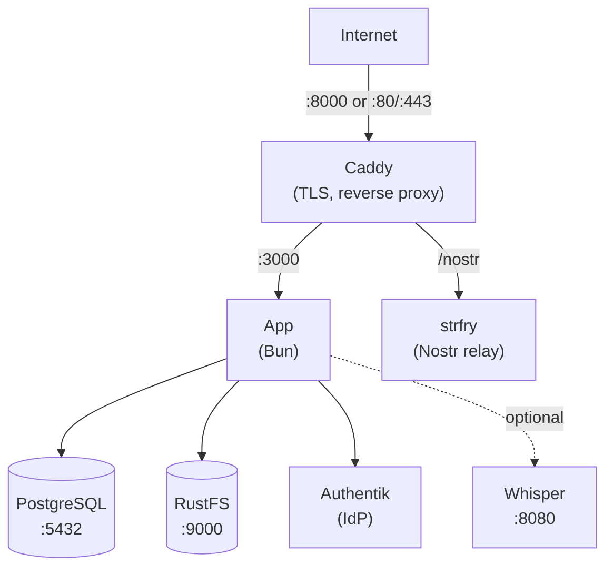

Esta guia te lleva paso a paso por el despliegue de Llamenos con Docker Compose en un solo servidor. Tendras una linea de ayuda completamente funcional con HTTPS automatico, base de datos PostgreSQL, almacenamiento de objetos, proveedor de identidad, relay en tiempo real y transcripcion opcional — todo gestionado por Docker Compose.

## Requisitos previos

- Un servidor Linux (Ubuntu 22.04+, Debian 12+ o similar)
- [Docker Engine](https://docs.docker.com/engine/install/) v24+ con Docker Compose v2
- `openssl` (preinstalado en la mayoria de sistemas)
- Un nombre de dominio con DNS apuntando a la IP de tu servidor

## Inicio rapido (local)

Para probar Llamenos localmente:

```bash
git clone https://github.com/rhonda-rodododo/llamenos.git
cd llamenos
./scripts/docker-setup.sh
```

Visita **http://localhost:8000** y sigue el asistente de configuracion para crear tu cuenta de administrador.

## Despliegue en produccion

```bash
git clone https://github.com/rhonda-rodododo/llamenos.git
cd llamenos
./scripts/docker-setup.sh --domain hotline.yourorg.com --email admin@yourorg.com
```

El script de configuracion:
1. Genera secretos aleatorios fuertes (contrasena de base de datos, clave HMAC, credenciales de almacenamiento, secreto del relay Nostr)
2. Los escribe en `deploy/docker/.env`
3. Construye e inicia todos los servicios usando la **capa de produccion de Docker Compose** (`docker-compose.production.yml`)
4. Espera a que la aplicacion este saludable

La capa de produccion agrega:
- **Terminacion TLS** via Let's Encrypt (Caddy con Caddyfile de produccion)
- **Rotacion de logs** para todos los servicios (10 MB maximo, 5 archivos)
- **Limites de recursos** (1 GB de memoria para la aplicacion)
- **CSP estricto** — solo conexiones WebSocket `wss://` (sin `ws://` plano)

Visita `https://hotline.yourorg.com` y sigue el asistente de configuracion para crear tu cuenta de administrador y configurar los canales.

### Configuracion manual

Si prefieres configurar todo manualmente en lugar de usar el script:

```bash
cd deploy/docker
cp .env.example .env
```

Edita `.env` y completa los secretos requeridos. Genera valores aleatorios:

```bash
# Para secretos hexadecimales (HMAC_SECRET, SERVER_NOSTR_SECRET):
openssl rand -hex 32

# Para contrasenas (PG_PASSWORD, STORAGE_ACCESS_KEY, STORAGE_SECRET_KEY):
openssl rand -base64 24
```

Establece tu dominio y correo electronico para los certificados TLS:

```env
DOMAIN=hotline.yourorg.com
ACME_EMAIL=admin@yourorg.com
```

Luego inicia los servicios con la capa de produccion:

```bash
docker compose -f docker-compose.yml -f docker-compose.production.yml up -d
```

## Archivos de Docker Compose

| Archivo | Proposito |
|---------|-----------|
| `docker-compose.yml` | Configuracion base — todos los servicios, redes, volumenes |
| `docker-compose.production.yml` | Capa de produccion — Caddyfile con TLS, rotacion de logs, limites de recursos |
| `docker-compose.test.yml` | Capa de pruebas — expone el puerto de la aplicacion, modo desarrollo |

El **desarrollo local** usa solo el archivo base. **Produccion** apila la capa de produccion encima.

## Servicios principales

La configuracion inicia seis servicios principales:

| Servicio | Proposito | Puerto |
|----------|-----------|--------|
| **app** | Aplicacion Llamenos (Bun) | 3000 (interno) |
| **postgres** | Base de datos PostgreSQL | 5432 (interno) |
| **caddy** | Proxy inverso + TLS automatico | 8000 (local), 80/443 (produccion) |
| **rustfs** | Almacenamiento de archivos compatible con S3 (RustFS) | 9000 (interno) |
| **strfry** | Relay Nostr para eventos en tiempo real | 7777 (interno) |
| **authentik** | Proveedor de identidad (SSO, incorporacion por invitacion, MFA) | 9443 (interno) |

Verifica que todo este funcionando:

```bash
cd deploy/docker
docker compose -f docker-compose.yml -f docker-compose.production.yml ps
docker compose -f docker-compose.yml -f docker-compose.production.yml logs app --tail 50
```

Verifica el endpoint de salud:

```bash
curl https://hotline.yourorg.com/api/health
# {"status":"ok"}
```

## Primer inicio de sesion

Abre la URL de tu linea de ayuda en un navegador. El asistente de configuracion te guiara a traves de:

1. **Crear cuenta de administrador** — recibiras un enlace de invitacion de Authentik. Haz clic en el enlace, configura tus credenciales, y tu cuenta de administrador se aprovisionara.
2. **Nombrar tu linea de ayuda** — establece el nombre visible
3. **Elegir canales** — activa Voz, SMS, WhatsApp, Signal y/o Reportes
4. **Configurar proveedores** — ingresa las credenciales de cada canal
5. **Revisar y finalizar**

## Configurar webhooks

Apunta los webhooks de tu proveedor de telefonia a tu dominio:

- **Voz (entrante)**: `https://hotline.yourorg.com/api/telephony/incoming`
- **Voz (estado)**: `https://hotline.yourorg.com/api/telephony/status`
- **SMS**: `https://hotline.yourorg.com/api/messaging/sms/webhook`
- **WhatsApp**: `https://hotline.yourorg.com/api/messaging/whatsapp/webhook`
- **Signal**: Configura el puente para reenviar a `https://hotline.yourorg.com/api/messaging/signal/webhook`

Consulta las guias especificas por proveedor: [Twilio](/docs/deploy/providers/twilio), [SignalWire](/docs/deploy/providers/signalwire), [Vonage](/docs/deploy/providers/vonage), [Plivo](/docs/deploy/providers/plivo), [Asterisk](/docs/deploy/providers/asterisk).

## Opcional: Habilitar transcripcion

El servicio de transcripcion Whisper requiere RAM adicional (4 GB+):

```bash
docker compose -f docker-compose.yml -f docker-compose.production.yml --profile transcription up -d
```

Configura el modelo en tu `.env`:

```env
WHISPER_MODEL=Systran/faster-whisper-base   # o small, medium, large
WHISPER_DEVICE=cpu                           # o cuda para GPU
```

## Opcional: Habilitar Asterisk

Para telefonia SIP autoalojada (consulta la [configuracion de Asterisk](/docs/deploy/providers/asterisk)):

```bash
# Agrega las credenciales a .env primero
echo "ARI_PASSWORD=$(openssl rand -base64 24)" >> deploy/docker/.env
echo "BRIDGE_SECRET=$(openssl rand -hex 32)" >> deploy/docker/.env

docker compose -f docker-compose.yml -f docker-compose.production.yml --profile asterisk up -d
```

## Opcional: Habilitar Signal

Para mensajeria Signal (consulta la [configuracion de Signal](/docs/deploy/providers/signal)):

```bash
docker compose -f docker-compose.yml -f docker-compose.production.yml --profile signal up -d
```

## Actualizacion

Descarga el codigo mas reciente y reconstruye:

```bash
cd /path/to/llamenos/deploy/docker
git -C ../.. pull
docker compose -f docker-compose.yml -f docker-compose.production.yml build
docker compose -f docker-compose.yml -f docker-compose.production.yml up -d
```

Los datos se persisten en volumenes de Docker (`postgres-data`, `rustfs-data`, etc.) y sobreviven a reinicios y reconstrucciones de contenedores.

## Copias de seguridad

### PostgreSQL

```bash
docker compose -f docker-compose.yml -f docker-compose.production.yml exec postgres pg_dump -U llamenos llamenos > backup-$(date +%Y%m%d).sql
```

Para restaurar:

```bash
docker compose -f docker-compose.yml -f docker-compose.production.yml exec -T postgres psql -U llamenos llamenos < backup-20250101.sql
```

### Almacenamiento RustFS

RustFS almacena archivos subidos, grabaciones y adjuntos. Usa cualquier CLI compatible con S3 (por ejemplo, `mc` o `aws s3`) para respaldar los datos, o simplemente respalda el volumen de Docker `rustfs-data` directamente.

### Copias de seguridad automatizadas

Para produccion, configura un trabajo cron:

```bash
# /etc/cron.d/llamenos-backup
0 3 * * * root cd /opt/llamenos/deploy/docker && docker compose -f docker-compose.yml -f docker-compose.production.yml exec -T postgres pg_dump -U llamenos llamenos | gzip > /backups/llamenos-$(date +\%Y\%m\%d).sql.gz 2>&1 | logger -t llamenos-backup
```

## Monitoreo

### Verificaciones de salud

La aplicacion expone `/api/health`. Docker Compose tiene verificaciones de salud integradas para todos los servicios. Monitorea externamente con cualquier verificador de tiempo de actividad HTTP.

### Logs

```bash
cd /opt/llamenos/deploy/docker

# Todos los servicios
docker compose -f docker-compose.yml -f docker-compose.production.yml logs -f

# Servicio especifico
docker compose -f docker-compose.yml -f docker-compose.production.yml logs -f app

# Ultimas 100 lineas
docker compose -f docker-compose.yml -f docker-compose.production.yml logs --tail 100 app
```

## Solucion de problemas

### La aplicacion no inicia

```bash
docker compose -f docker-compose.yml -f docker-compose.production.yml logs app
docker compose -f docker-compose.yml -f docker-compose.production.yml config  # verificar que .env se carga
docker compose -f docker-compose.yml -f docker-compose.production.yml ps       # verificar salud de servicios
```

### Problemas con certificados

Caddy necesita los puertos 80 y 443 abiertos para los desafios ACME:

```bash
docker compose -f docker-compose.yml -f docker-compose.production.yml logs caddy
curl -I http://hotline.yourorg.com
```

## Arquitectura de servicios



## Siguientes pasos

- [Guia de Administrador](/es/docs/guides/?audience=operator) — configura la linea de ayuda
- [Descripcion General del Autoalojamiento](/es/docs/deploy/self-hosting) — compara opciones de despliegue
- [Despliegue en Kubernetes](/es/docs/deploy/kubernetes) — migra a Helm
- [QUICKSTART.md](https://github.com/rhonda-rodododo/llamenos/blob/main/docs/QUICKSTART.md) — aprovisionamiento de VPS y endurecimiento del servidor
