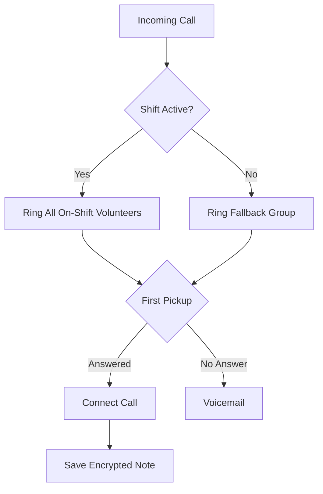

Pon en marcha una linea de ayuda Llamenos en tu equipo local o en un servidor. Solo se necesita Docker — no se requiere Node.js, Bun ni otros entornos de ejecucion.

## Como funciona

Cuando alguien llama al numero de tu linea de ayuda, Llamenos enruta la llamada a todos los voluntarios en turno simultaneamente. El primer voluntario en contestar se conecta, y los demas dejan de sonar. Despues de que la llamada termina, el voluntario puede guardar notas cifradas sobre la conversacion.



El mismo enrutamiento se aplica a mensajes de SMS, WhatsApp y Signal — aparecen en una vista unificada de **Conversaciones** donde los voluntarios pueden responder.

## Requisitos previos

- [Docker](https://docs.docker.com/get-docker/) con Docker Compose v2
- `openssl` (preinstalado en la mayoria de sistemas Linux y macOS)
- Git

## Inicio rapido

```bash
git clone https://github.com/rhonda-rodododo/llamenos.git
cd llamenos
./scripts/docker-setup.sh
```

Esto genera todos los secretos necesarios, construye la aplicacion e inicia los servicios. Una vez completado, visita **http://localhost:8000** y el asistente de configuracion te guiara a traves de:

1. **Crea tu cuenta de administrador** — recibiras un enlace de invitacion de tu proveedor de identidad (Authentik). Haz clic en el enlace, configura tus credenciales, y tu cuenta de administrador se aprovisionara automaticamente.
2. **Nombra tu linea de ayuda** — establece el nombre visible
3. **Elige los canales** — activa Voz, SMS, WhatsApp, Signal y/o Reportes
4. **Configura los proveedores** — ingresa las credenciales de cada canal habilitado
5. **Revisa y finaliza**

### Prueba el modo demostracion

Para explorar con datos de ejemplo precargados e inicio de sesion con un clic (sin necesidad de crear una cuenta):

```bash
./scripts/docker-setup.sh --demo
```

## Despliegue en produccion

Para un servidor con un dominio real y TLS automatico:

```bash
./scripts/docker-setup.sh --domain hotline.yourorg.com --email admin@yourorg.com
```

Caddy aprovisiona automaticamente certificados TLS de Let's Encrypt. Asegurate de que los puertos 80 y 443 esten abiertos. La opcion `--domain` activa la capa de produccion de Docker Compose, que agrega TLS, rotacion de logs y limites de recursos.

Consulta la [guia de despliegue con Docker Compose](/es/docs/deploy/docker) para detalles completos sobre endurecimiento del servidor, copias de seguridad, monitoreo y servicios opcionales.

## Servicios principales

La configuracion de Docker inicia seis servicios principales:

| Servicio | Proposito | Puerto |
|----------|-----------|--------|
| **app** | Aplicacion Llamenos (Bun) | 3000 (interno) |
| **postgres** | Base de datos PostgreSQL | 5432 (interno) |
| **caddy** | Proxy inverso + TLS automatico | 8000 (local), 80/443 (produccion) |
| **rustfs** | Almacenamiento de archivos compatible con S3 (RustFS) | 9000 (interno) |
| **strfry** | Relay Nostr para eventos en tiempo real | 7777 (interno) |
| **authentik** | Proveedor de identidad (SSO, incorporacion por invitacion) | 9443 (interno) |

## Configurar webhooks

Despues de desplegar, apunta los webhooks de tu proveedor de telefonia a la URL de tu despliegue:

| Webhook | URL |
|---------|-----|
| Voz (entrante) | `https://your-domain/api/telephony/incoming` |
| Voz (estado) | `https://your-domain/api/telephony/status` |
| SMS | `https://your-domain/api/messaging/sms/webhook` |
| WhatsApp | `https://your-domain/api/messaging/whatsapp/webhook` |
| Signal | Configura el puente para reenviar a `https://your-domain/api/messaging/signal/webhook` |

Para configuracion especifica por proveedor: [Twilio](/docs/deploy/providers/twilio), [SignalWire](/docs/deploy/providers/signalwire), [Vonage](/docs/deploy/providers/vonage), [Plivo](/docs/deploy/providers/plivo), [Asterisk](/docs/deploy/providers/asterisk), [SMS](/docs/deploy/providers/sms), [WhatsApp](/docs/deploy/providers/whatsapp), [Signal](/docs/deploy/providers/signal).

## Siguientes pasos

- [Despliegue con Docker Compose](/es/docs/deploy/docker) — guia completa de despliegue en produccion con copias de seguridad y monitoreo
- [Guia de Administrador](/es/docs/guides/?audience=operator) — agrega voluntarios, crea turnos, configura canales y ajustes
- [Guia de Voluntario](/es/docs/guides/?audience=staff) — comparte con tus voluntarios
- [Proveedores de Telefonia](/es/docs/deploy/providers/) — compara proveedores de voz
- [Modelo de Seguridad](/security) — comprende el cifrado y el modelo de amenazas
