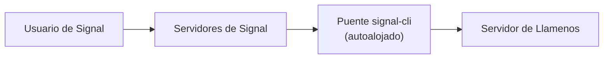

Llamenos soporta mensajería de Signal a través de un puente autoalojado [signal-cli-rest-api](https://github.com/bbernhard/signal-cli-rest-api). Signal ofrece las garantías de privacidad más sólidas de cualquier canal de mensajería, lo que lo hace ideal para escenarios sensibles de respuesta a crisis.

## Requisitos previos

- Un servidor Linux o VM para el puente (puede ser el mismo servidor que Asterisk, o uno separado)
- Docker instalado en el servidor del puente
- Un número de teléfono dedicado para el registro en Signal
- Acceso de red desde el puente hacia su servidor de Llamenos

## Arquitectura



El puente signal-cli se ejecuta en su infraestructura y reenvía mensajes a su servidor mediante webhooks HTTP. Esto significa que usted controla toda la ruta del mensaje desde Signal hasta su aplicación.

## 1. Desplegar el puente signal-cli

Ejecute el contenedor Docker de signal-cli-rest-api:

```bash
docker run -d \
  --name signal-cli \
  --restart unless-stopped \
  -p 8080:8080 \
  -v signal-cli-data:/home/.local/share/signal-cli \
  -e MODE=json-rpc \
  bbernhard/signal-cli-rest-api:latest
```

## 2. Registrar un número de teléfono

Registre el puente con un número de teléfono dedicado:

```bash
# Solicitar un código de verificación por SMS
curl -X POST http://localhost:8080/v1/register/+1234567890

# Verificar con el código recibido
curl -X POST http://localhost:8080/v1/register/+1234567890/verify/123456
```

## 3. Configurar el reenvío de webhooks

Configure el puente para reenviar los mensajes entrantes a su servidor:

```bash
curl -X PUT http://localhost:8080/v1/about \
  -H "Content-Type: application/json" \
  -d '{
    "webhook": {
      "url": "https://your-domain.com/api/messaging/signal/webhook",
      "headers": {
        "Authorization": "Bearer your-webhook-secret"
      }
    }
  }'
```

## 4. Habilitar Signal en la configuración de administración

Navegue a **Configuración de administración > Canales de mensajería** (o use el asistente de configuración) y active **Signal**.

Ingrese lo siguiente:
- **URL del puente** — la URL de su puente signal-cli (por ejemplo, `https://signal-bridge.example.com:8080`)
- **Clave API del puente** — un token bearer para autenticar las solicitudes al puente
- **Secreto del webhook** — el secreto utilizado para validar los webhooks entrantes (debe coincidir con lo configurado en el paso 3)
- **Número registrado** — el número de teléfono registrado en Signal

## 5. Probar

Envíe un mensaje de Signal a su número de teléfono registrado. La conversación debería aparecer en la pestaña **Conversaciones**.

## Monitoreo de estado

Llamenos monitorea el estado del puente signal-cli:
- Verificaciones periódicas de estado al endpoint `/v1/about` del puente
- Degradación elegante si el puente es inalcanzable — los demás canales siguen funcionando
- Alertas para administradores cuando el puente se cae

## Transcripción de mensajes de voz

Los mensajes de voz de Signal pueden ser transcritos directamente en el navegador del voluntario usando Whisper del lado del cliente (WASM mediante `@huggingface/transformers`). El audio nunca sale del dispositivo — la transcripción se cifra y se almacena junto al mensaje de voz en la vista de conversación. Los voluntarios pueden habilitar o deshabilitar la transcripción en su configuración personal.

## Notas de seguridad

- Signal proporciona cifrado de extremo a extremo entre el usuario y el puente signal-cli
- El puente descifra los mensajes para reenviarlos como webhooks — el servidor del puente tiene acceso al texto plano
- La autenticación de webhooks utiliza tokens bearer con comparación en tiempo constante
- Mantenga el puente en la misma red que su servidor Asterisk (si corresponde) para minimizar la exposición
- El puente almacena el historial de mensajes localmente en su volumen Docker — considere el cifrado en reposo
- Para máxima privacidad: autoaloje tanto Asterisk (voz) como signal-cli (mensajería) en su propia infraestructura

## Solución de problemas

- **El puente no recibe mensajes**: Verifique que el número de teléfono esté correctamente registrado con `GET /v1/about`
- **Fallos en la entrega de webhooks**: Verifique que la URL del webhook sea accesible desde el servidor del puente y que el encabezado de autorización coincida
- **Problemas de registro**: Algunos números de teléfono pueden necesitar ser desvinculados de una cuenta de Signal existente primero
