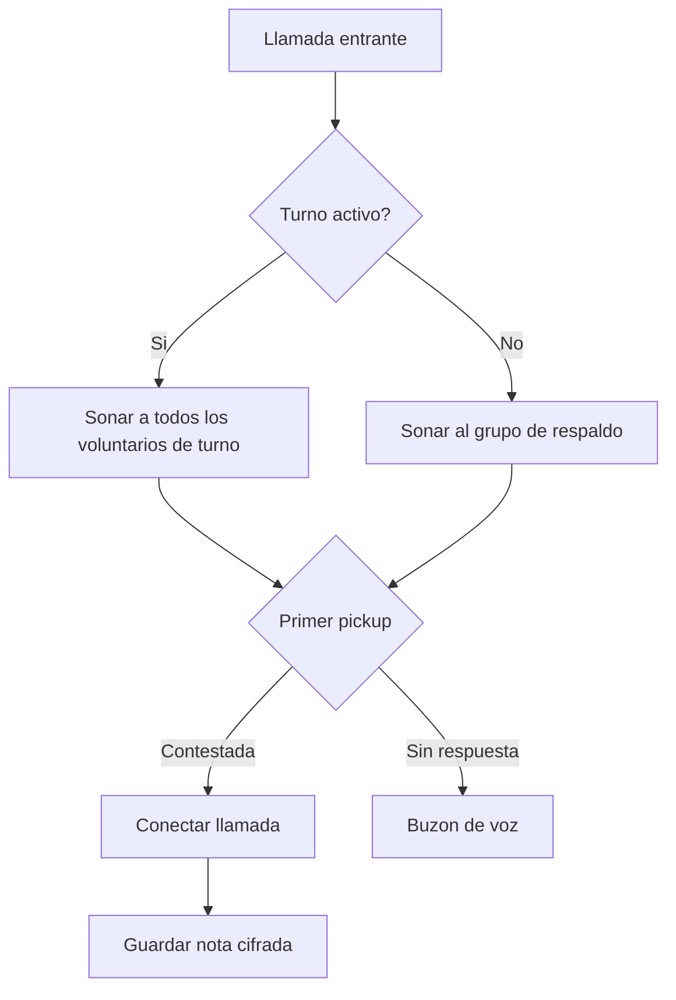

Pon en marcha una linea de Llamenos localmente o en un servidor. Solo se necesita Docker — no se requiere Node.js, Bun ni otros entornos de ejecucion.

## Como funciona

Cuando alguien llama a tu numero de linea, Llamenos enruta la llamada a todos los voluntarios de turno simultaneamente. El primer voluntario que contesta se conecta y los demas dejan de sonar. Despues de la llamada, el voluntario puede guardar notas cifradas sobre la conversacion.



Lo mismo aplica para mensajes SMS, WhatsApp y Signal — aparecen en una vista unificada de **Conversaciones** donde los voluntarios pueden responder.

## Requisitos previos

- [Docker](https://docs.docker.com/get-docker/) con Docker Compose v2
- `openssl` (preinstalado en la mayoria de sistemas Linux y macOS)
- Git

## Inicio rapido

```bash
git clone https://github.com/rhonda-rodododo/llamenos.git
cd llamenos
./scripts/docker-setup.sh
```

Esto genera todos los secretos necesarios, construye la aplicacion e inicia los servicios. Una vez listo, visita **http://localhost** y el asistente de configuracion te guiara para:

1. **Crear tu cuenta de administrador** — genera un par de claves criptograficas en tu navegador
2. **Nombrar tu linea** — establece el nombre para mostrar
3. **Elegir canales** — habilita Voz, SMS, WhatsApp, Signal y/o Reportes
4. **Configurar proveedores** — ingresa las credenciales de cada canal habilitado
5. **Revisar y finalizar**

### Probar el modo demo

Para explorar con datos de ejemplo y login de un clic (sin necesidad de crear cuenta):

```bash
./scripts/docker-setup.sh --demo
```

## Despliegue en produccion

Para un servidor con dominio real y TLS automatico:

```bash
./scripts/docker-setup.sh --domain linea.tuorg.com --email admin@tuorg.com
```

Caddy provisiona automaticamente certificados TLS via Let's Encrypt. Asegurate de que los puertos 80 y 443 esten abiertos.

Consulta la [guia de despliegue con Docker Compose](/docs/deploy-docker) para detalles completos sobre hardening del servidor, backups, monitoreo y servicios opcionales.

## Configurar webhooks

Despues de desplegar, apunta los webhooks de tu proveedor de telefonia a tu URL de despliegue:

| Webhook | URL |
|---------|-----|
| Voz (entrante) | `https://tu-dominio/api/telephony/incoming` |
| Voz (estado) | `https://tu-dominio/api/telephony/status` |
| SMS | `https://tu-dominio/api/messaging/sms/webhook` |
| WhatsApp | `https://tu-dominio/api/messaging/whatsapp/webhook` |
| Signal | Configura el bridge para reenviar a `https://tu-dominio/api/messaging/signal/webhook` |

Para configuracion especifica: [Twilio](/docs/setup-twilio), [SignalWire](/docs/setup-signalwire), [Vonage](/docs/setup-vonage), [Plivo](/docs/setup-plivo), [Asterisk](/docs/setup-asterisk), [SMS](/docs/setup-sms), [WhatsApp](/docs/setup-whatsapp), [Signal](/docs/setup-signal).

## Siguientes pasos

- [Despliegue con Docker Compose](/docs/deploy-docker) — guia completa de despliegue en produccion con backups y monitoreo
- [Guia de Administrador](/docs/admin-guide) — agrega voluntarios, crea turnos, configura canales y ajustes
- [Guia de Voluntario](/docs/volunteer-guide) — comparte con tus voluntarios
- [Guia de Reportero](/docs/reporter-guide) — configura el rol de reportero para envio de reportes cifrados
- [Proveedores de Telefonia](/docs/telephony-providers) — compara proveedores de voz
- [Modelo de Seguridad](/security) — entiende el cifrado y el modelo de amenazas
