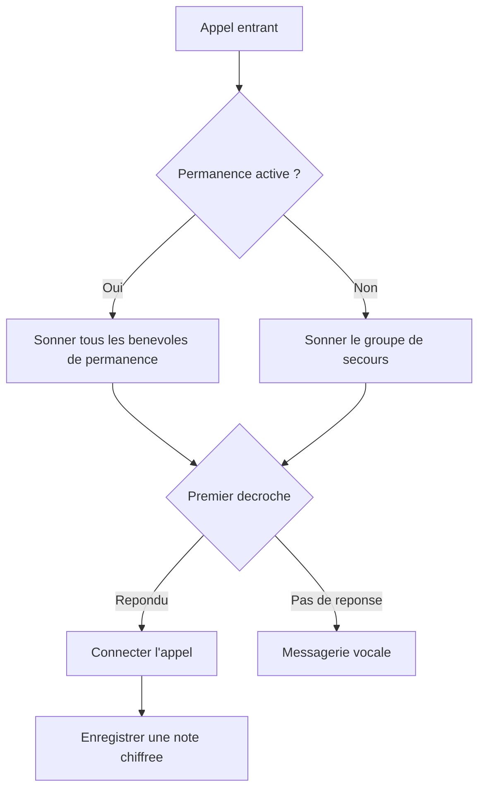

Lancez une ligne Llamenos en local ou sur un serveur. Seul Docker est necessaire — pas besoin de Node.js, Bun ou d'autres environnements d'execution.

## Comment ca fonctionne

Lorsque quelqu'un appelle votre numero de ligne, Llamenos achemine l'appel simultanement vers tous les benevoles de permanence. Le premier benevole a repondre est connecte, et les autres cessent de sonner. Apres l'appel, le benevole peut enregistrer des notes chiffrees sur la conversation.



Le meme principe s'applique aux messages SMS, WhatsApp et Signal — ils apparaissent dans une vue unifiee **Conversations** ou les benevoles peuvent repondre.

## Prerequis

- [Docker](https://docs.docker.com/get-docker/) avec Docker Compose v2
- `openssl` (pre-installe sur la plupart des systemes Linux et macOS)
- Git

## Demarrage rapide

```bash
git clone https://github.com/rhonda-rodododo/llamenos.git
cd llamenos
./scripts/docker-setup.sh
```

Cela genere tous les secrets necessaires, construit l'application et demarre les services. Une fois termine, rendez-vous sur **http://localhost:8000** et l'assistant de configuration vous guidera pour :

1. **Creer votre compte administrateur** — genere une paire de cles cryptographiques dans votre navigateur
2. **Nommer votre ligne** — definissez le nom d'affichage
3. **Choisir les canaux** — activez Voix, SMS, WhatsApp, Signal et/ou Rapports
4. **Configurer les fournisseurs** — entrez les identifiants pour chaque canal active
5. **Verifier et terminer**

### Essayer le mode demo

Pour explorer avec des donnees d'exemple pre-remplies et une connexion en un clic (sans creation de compte) :

```bash
./scripts/docker-setup.sh --demo
```

## Deploiement en production

Pour un serveur avec un vrai domaine et TLS automatique :

```bash
./scripts/docker-setup.sh --domain ligne.votreorg.com --email admin@votreorg.com
```

Caddy provisionne automatiquement les certificats TLS Let's Encrypt. Assurez-vous que les ports 80 et 443 sont ouverts. L'option `--domain` active la couche de production Docker Compose, qui ajoute TLS, la rotation des logs et les limites de ressources.

Consultez le [guide de deploiement Docker Compose](/docs/deploy-docker) pour les details complets sur le durcissement du serveur, les sauvegardes, la surveillance et les services optionnels.

## Configurer les webhooks

Apres le deploiement, dirigez les webhooks de votre fournisseur de telephonie vers votre URL de deploiement :

| Webhook | URL |
|---------|-----|
| Voix (entrant) | `https://votre-domaine/api/telephony/incoming` |
| Voix (statut) | `https://votre-domaine/api/telephony/status` |
| SMS | `https://votre-domaine/api/messaging/sms/webhook` |
| WhatsApp | `https://votre-domaine/api/messaging/whatsapp/webhook` |
| Signal | Configurez le bridge pour rediriger vers `https://votre-domaine/api/messaging/signal/webhook` |

Pour la configuration specifique a chaque fournisseur : [Twilio](/docs/setup-twilio), [SignalWire](/docs/setup-signalwire), [Vonage](/docs/setup-vonage), [Plivo](/docs/setup-plivo), [Asterisk](/docs/setup-asterisk), [SMS](/docs/setup-sms), [WhatsApp](/docs/setup-whatsapp), [Signal](/docs/setup-signal).

## Prochaines etapes

- [Deploiement Docker Compose](/docs/deploy-docker) — guide complet de deploiement en production avec sauvegardes et surveillance
- [Guide administrateur](/docs/admin-guide) — ajouter des benevoles, creer des permanences, configurer les canaux et parametres
- [Guide du benevole](/docs/volunteer-guide) — partagez avec vos benevoles
- [Guide du rapporteur](/docs/reporter-guide) — configurer le role de rapporteur pour les soumissions de rapports chiffres
- [Fournisseurs de telephonie](/docs/telephony-providers) — comparer les fournisseurs vocaux
- [Modele de securite](/security) — comprendre le chiffrement et le modele de menace
