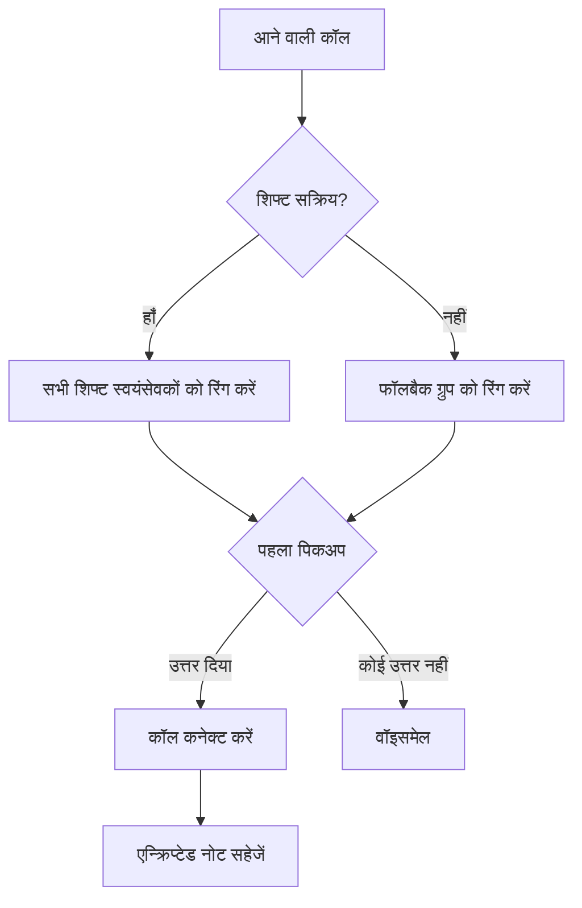

Llamenos हॉटलाइन को स्थानीय रूप से या सर्वर पर चालू करें। केवल Docker आवश्यक है — Node.js, Bun या अन्य रनटाइम की कोई आवश्यकता नहीं।

## यह कैसे काम करता है

जब कोई आपके हॉटलाइन नंबर पर कॉल करता है, तो Llamenos कॉल को एक साथ सभी ड्यूटी पर मौजूद स्वयंसेवकों तक पहुँचाता है। जो स्वयंसेवक पहले उठाता है, वह जुड़ जाता है, और बाकी की रिंग बंद हो जाती है। कॉल समाप्त होने के बाद, स्वयंसेवक बातचीत के बारे में एन्क्रिप्टेड नोट्स सहेज सकता है।



SMS, WhatsApp और Signal संदेशों पर भी यही लागू होता है — वे एक एकीकृत **वार्तालाप** दृश्य में दिखाई देते हैं जहाँ स्वयंसेवक जवाब दे सकते हैं।

## पूर्वापेक्षाएँ

- [Docker](https://docs.docker.com/get-docker/) Docker Compose v2 के साथ
- `openssl` (अधिकांश Linux और macOS सिस्टम पर पहले से इंस्टॉल)
- Git

## त्वरित शुरुआत

```bash
git clone https://github.com/rhonda-rodododo/llamenos.git
cd llamenos
./scripts/docker-setup.sh
```

यह सभी आवश्यक सीक्रेट्स जनरेट करता है, एप्लिकेशन बनाता है, और सेवाएँ शुरू करता है। पूरा होने पर, **http://localhost:8000** पर जाएँ और सेटअप विज़ार्ड आपको मार्गदर्शन करेगा:

1. **अपना एडमिन अकाउंट बनाएँ** — आपके ब्राउज़र में क्रिप्टोग्राफ़िक की-पेयर जनरेट करता है
2. **अपनी हॉटलाइन का नाम रखें** — प्रदर्शन नाम सेट करें
3. **चैनल चुनें** — वॉइस, SMS, WhatsApp, Signal और/या रिपोर्ट्स सक्षम करें
4. **प्रदाता कॉन्फ़िगर करें** — प्रत्येक सक्षम चैनल के लिए क्रेडेंशियल दर्ज करें
5. **समीक्षा करें और समाप्त करें**

### डेमो मोड आज़माएँ

पहले से भरे नमूना डेटा और एक-क्लिक लॉगिन के साथ अन्वेषण करने के लिए (अकाउंट बनाने की आवश्यकता नहीं):

```bash
./scripts/docker-setup.sh --demo
```

## प्रोडक्शन तैनाती

वास्तविक डोमेन और स्वचालित TLS वाले सर्वर के लिए:

```bash
./scripts/docker-setup.sh --domain hotline.yourorg.com --email admin@yourorg.com
```

Caddy स्वचालित रूप से Let's Encrypt TLS प्रमाणपत्र प्रदान करता है। सुनिश्चित करें कि पोर्ट 80 और 443 खुले हैं। `--domain` विकल्प Docker Compose प्रोडक्शन ओवरले सक्रिय करता है, जो TLS, लॉग रोटेशन और संसाधन सीमाएँ जोड़ता है।

सर्वर हार्डनिंग, बैकअप, मॉनिटरिंग और वैकल्पिक सेवाओं के पूर्ण विवरण के लिए [Docker Compose तैनाती गाइड](/docs/deploy-docker) देखें।

## Webhooks कॉन्फ़िगर करें

तैनाती के बाद, अपने टेलीफ़ोनी प्रदाता के webhooks को अपनी तैनाती URL पर पॉइंट करें:

| Webhook | URL |
|---------|-----|
| वॉइस (इनकमिंग) | `https://your-domain/api/telephony/incoming` |
| वॉइस (स्टेटस) | `https://your-domain/api/telephony/status` |
| SMS | `https://your-domain/api/messaging/sms/webhook` |
| WhatsApp | `https://your-domain/api/messaging/whatsapp/webhook` |
| Signal | ब्रिज को `https://your-domain/api/messaging/signal/webhook` पर फॉरवर्ड करने के लिए कॉन्फ़िगर करें |

प्रदाता-विशिष्ट सेटअप के लिए: [Twilio](/docs/setup-twilio), [SignalWire](/docs/setup-signalwire), [Vonage](/docs/setup-vonage), [Plivo](/docs/setup-plivo), [Asterisk](/docs/setup-asterisk), [SMS](/docs/setup-sms), [WhatsApp](/docs/setup-whatsapp), [Signal](/docs/setup-signal)।

## अगले कदम

- [Docker Compose तैनाती](/docs/deploy-docker) — बैकअप और मॉनिटरिंग के साथ पूर्ण प्रोडक्शन तैनाती गाइड
- [एडमिन गाइड](/docs/admin-guide) — स्वयंसेवक जोड़ें, शिफ्ट बनाएँ, चैनल और सेटिंग्स कॉन्फ़िगर करें
- [स्वयंसेवक गाइड](/docs/volunteer-guide) — अपने स्वयंसेवकों के साथ साझा करें
- [रिपोर्टर गाइड](/docs/reporter-guide) — एन्क्रिप्टेड रिपोर्ट सबमिशन के लिए रिपोर्टर भूमिका सेट करें
- [टेलीफ़ोनी प्रदाता](/docs/telephony-providers) — वॉइस प्रदाताओं की तुलना करें
- [सुरक्षा मॉडल](/security) — एन्क्रिप्शन और खतरे के मॉडल को समझें
