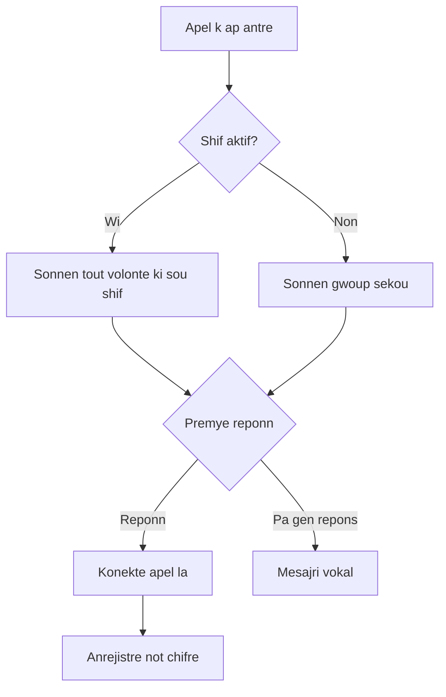

Mete yon liy Llamenos ap mache lokalman oswa sou yon serve. Se Docker selman ki nesese — pa bezwen Node.js, Bun oswa lot anviwonman egzekisyon.

## Kijan li fonksyone

Le yon moun rele nimewo liy direkt ou a, Llamenos voye apel la bay tout volonte ki sou shif la anmenm tan. Premye volonte ki reponn nan konekte, epi lot yo sispann sonnen. Apre apel la, volonte a ka anrejistre not chifre sou konvesasyon an.



Menm bagay la aplike pou mesaj SMS, WhatsApp ak Signal — yo parèt nan yon vi inifye **Konvesasyon** kote volonte yo ka reponn.

## Kondisyon prealab

- [Docker](https://docs.docker.com/get-docker/) ak Docker Compose v2
- `openssl` (pre-enstale sou pifò sistem Linux ak macOS)
- Git

## Demaraj rapid

```bash
git clone https://github.com/rhonda-rodododo/llamenos.git
cd llamenos
./scripts/docker-setup.sh
```

Sa a jenere tout sekrè ki nesesè yo, bati aplikasyon an, epi demarè sèvis yo. Yon fwa li fini, vizite **http://localhost:8000** epi asistan konfigirasyon an ap gide w nan:

1. **Kreye kont administratè w** — jenere yon pè kle kriptografik nan navigatè w
2. **Bay liy ou yon non** — chwazi non pou afiche
3. **Chwazi kanal yo** — aktive Vwa, SMS, WhatsApp, Signal ak/oswa Rapò
4. **Konfigire founisè yo** — antre idantifyan pou chak kanal ki aktive
5. **Revize epi fini**

### Eseye mòd demonstrasyon

Pou eksplore ak done egzanp ki deja la ak koneksyon yon klik (pa bezwen kreye kont):

```bash
./scripts/docker-setup.sh --demo
```

## Depleman an pwodiksyon

Pou yon sèvè ak vre domèn ak TLS otomatik:

```bash
./scripts/docker-setup.sh --domain hotline.yourorg.com --email admin@yourorg.com
```

Caddy otomatikman bay sètifika TLS Let's Encrypt. Asire w pò 80 ak 443 ouvè. Opsyon `--domain` nan aktive kouch pwodiksyon Docker Compose, ki ajoute TLS, wotasyon log ak limit resous.

Gade [gid depleman Docker Compose](/docs/deploy-docker) pou tout detay sou sekirite sèvè, backup, siveyans ak sèvis opsyonèl.

## Konfigire webhooks

Apre depleman an, dirije webhooks founisè telefoni w nan URL depleman w:

| Webhook | URL |
|---------|-----|
| Vwa (k ap antre) | `https://your-domain/api/telephony/incoming` |
| Vwa (estati) | `https://your-domain/api/telephony/status` |
| SMS | `https://your-domain/api/messaging/sms/webhook` |
| WhatsApp | `https://your-domain/api/messaging/whatsapp/webhook` |
| Signal | Konfigire pon pou voye bay `https://your-domain/api/messaging/signal/webhook` |

Pou konfigirasyon espesifik pa founisè: [Twilio](/docs/setup-twilio), [SignalWire](/docs/setup-signalwire), [Vonage](/docs/setup-vonage), [Plivo](/docs/setup-plivo), [Asterisk](/docs/setup-asterisk), [SMS](/docs/setup-sms), [WhatsApp](/docs/setup-whatsapp), [Signal](/docs/setup-signal).

## Pwochen etap

- [Depleman Docker Compose](/docs/deploy-docker) — gid konplè depleman pwodiksyon ak backup ak siveyans
- [Gid Administratè](/docs/admin-guide) — ajoute volontè, kreye shif, konfigire kanal ak paramèt
- [Gid Volontè](/docs/volunteer-guide) — pataje ak volontè w yo
- [Gid Rapòtè](/docs/reporter-guide) — konfigire wòl rapòtè pou soumisyon rapò chifre
- [Founisè Telefoni](/docs/telephony-providers) — konpare founisè vwa
- [Modèl Sekirite](/security) — konprann chifreman ak modèl menas
