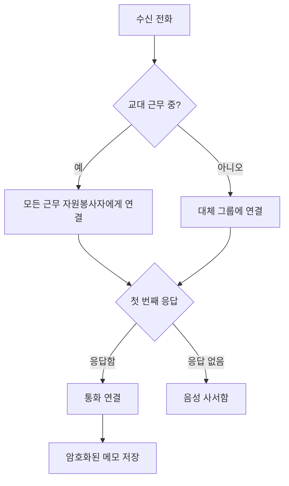

Llamenos 핫라인을 로컬 또는 서버에서 실행하세요. Docker만 있으면 됩니다 — Node.js, Bun 또는 기타 런타임은 필요하지 않습니다.

## 작동 방식

누군가 핫라인 번호로 전화하면, Llamenos가 근무 중인 모든 자원봉사자에게 동시에 전화를 연결합니다. 가장 먼저 받는 자원봉사자가 연결되고, 나머지는 울림이 중단됩니다. 통화 후 자원봉사자는 대화에 대한 암호화된 메모를 저장할 수 있습니다.



SMS, WhatsApp, Signal 메시지에도 동일하게 적용됩니다 — 자원봉사자가 응답할 수 있는 통합 **대화** 뷰에 표시됩니다.

## 사전 요구 사항

- [Docker](https://docs.docker.com/get-docker/) (Docker Compose v2 포함)
- `openssl` (대부분의 Linux 및 macOS 시스템에 사전 설치됨)
- Git

## 빠른 시작

```bash
git clone https://github.com/rhonda-rodododo/llamenos.git
cd llamenos
./scripts/docker-setup.sh
```

필요한 모든 시크릿을 생성하고, 애플리케이션을 빌드하며, 서비스를 시작합니다. 완료되면 **http://localhost:8000**을 방문하면 설정 마법사가 다음을 안내합니다:

1. **관리자 계정 생성** — 브라우저에서 암호화 키 쌍을 생성합니다
2. **핫라인 이름 지정** — 표시 이름을 설정합니다
3. **채널 선택** — 음성, SMS, WhatsApp, Signal 및/또는 보고서를 활성화합니다
4. **제공업체 구성** — 활성화된 각 채널의 자격 증명을 입력합니다
5. **검토 및 완료**

### 데모 모드 체험

사전 입력된 샘플 데이터와 원클릭 로그인으로 탐색 (계정 생성 불필요):

```bash
./scripts/docker-setup.sh --demo
```

## 프로덕션 배포

실제 도메인과 자동 TLS가 있는 서버의 경우:

```bash
./scripts/docker-setup.sh --domain hotline.yourorg.com --email admin@yourorg.com
```

Caddy가 자동으로 Let's Encrypt TLS 인증서를 프로비저닝합니다. 포트 80과 443이 열려 있는지 확인하세요. `--domain` 옵션은 TLS, 로그 순환 및 리소스 제한을 추가하는 Docker Compose 프로덕션 오버레이를 활성화합니다.

서버 강화, 백업, 모니터링 및 선택적 서비스에 대한 전체 세부 정보는 [Docker Compose 배포 가이드](/docs/deploy-docker)를 참조하세요.

## Webhook 구성

배포 후 텔레포니 제공업체의 webhook을 배포 URL로 지정하세요:

| Webhook | URL |
|---------|-----|
| 음성 (수신) | `https://your-domain/api/telephony/incoming` |
| 음성 (상태) | `https://your-domain/api/telephony/status` |
| SMS | `https://your-domain/api/messaging/sms/webhook` |
| WhatsApp | `https://your-domain/api/messaging/whatsapp/webhook` |
| Signal | 브리지를 `https://your-domain/api/messaging/signal/webhook`으로 전달하도록 구성 |

제공업체별 설정: [Twilio](/docs/setup-twilio), [SignalWire](/docs/setup-signalwire), [Vonage](/docs/setup-vonage), [Plivo](/docs/setup-plivo), [Asterisk](/docs/setup-asterisk), [SMS](/docs/setup-sms), [WhatsApp](/docs/setup-whatsapp), [Signal](/docs/setup-signal).

## 다음 단계

- [Docker Compose 배포](/docs/deploy-docker) — 백업 및 모니터링이 포함된 전체 프로덕션 배포 가이드
- [관리자 가이드](/docs/admin-guide) — 자원봉사자 추가, 교대 생성, 채널 및 설정 구성
- [자원봉사자 가이드](/docs/volunteer-guide) — 자원봉사자에게 공유하세요
- [리포터 가이드](/docs/reporter-guide) — 암호화된 보고서 제출을 위한 리포터 역할 설정
- [텔레포니 제공업체](/docs/telephony-providers) — 음성 제공업체 비교
- [보안 모델](/security) — 암호화 및 위협 모델 이해
