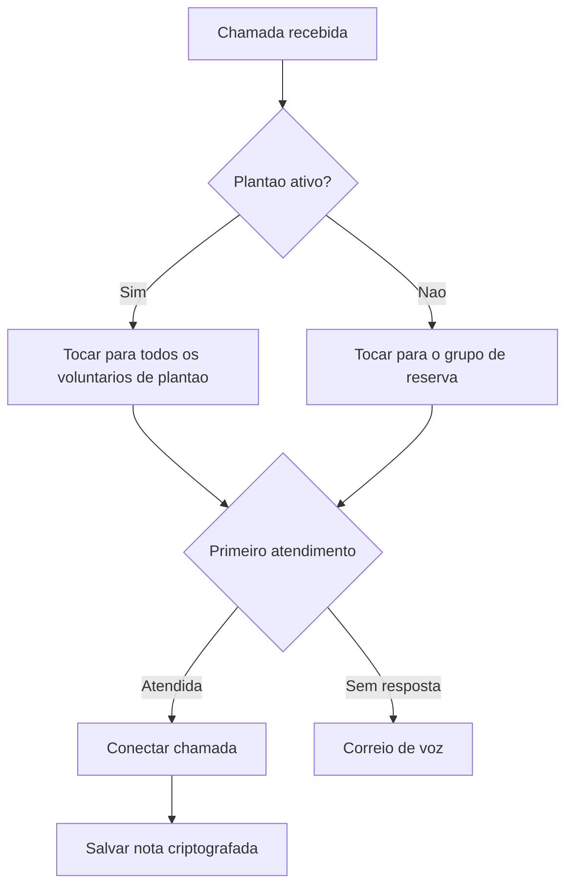

Coloque uma linha Llamenos em funcionamento localmente ou em um servidor. Apenas o Docker e necessario — nao e preciso Node.js, Bun ou outros ambientes de execucao.

## Como funciona

Quando alguem liga para o numero da sua linha, o Llamenos encaminha a chamada simultaneamente para todos os voluntarios de plantao. O primeiro voluntario a atender e conectado, e os demais param de tocar. Apos a chamada, o voluntario pode salvar notas criptografadas sobre a conversa.



O mesmo se aplica a mensagens SMS, WhatsApp e Signal — elas aparecem em uma visualizacao unificada de **Conversas** onde os voluntarios podem responder.

## Pre-requisitos

- [Docker](https://docs.docker.com/get-docker/) com Docker Compose v2
- `openssl` (pre-instalado na maioria dos sistemas Linux e macOS)
- Git

## Inicio rapido

```bash
git clone https://github.com/rhonda-rodododo/llamenos.git
cd llamenos
./scripts/docker-setup.sh
```

Isso gera todos os segredos necessarios, constroi a aplicacao e inicia os servicos. Quando concluido, visite **http://localhost:8000** e o assistente de configuracao guiara voce para:

1. **Criar sua conta de administrador** — gera um par de chaves criptograficas no seu navegador
2. **Nomear sua linha** — defina o nome de exibicao
3. **Escolher canais** — ative Voz, SMS, WhatsApp, Signal e/ou Relatorios
4. **Configurar provedores** — insira as credenciais para cada canal ativado
5. **Revisar e finalizar**

### Experimentar o modo demo

Para explorar com dados de exemplo pre-carregados e login com um clique (sem necessidade de criar conta):

```bash
./scripts/docker-setup.sh --demo
```

## Implantacao em producao

Para um servidor com dominio real e TLS automatico:

```bash
./scripts/docker-setup.sh --domain linha.suaorg.com --email admin@suaorg.com
```

O Caddy provisiona automaticamente certificados TLS do Let's Encrypt. Certifique-se de que as portas 80 e 443 estejam abertas. A opcao `--domain` ativa a camada de producao do Docker Compose, que adiciona TLS, rotacao de logs e limites de recursos.

Consulte o [guia de implantacao Docker Compose](/docs/deploy-docker) para detalhes completos sobre fortalecimento do servidor, backups, monitoramento e servicos opcionais.

## Configurar webhooks

Apos a implantacao, aponte os webhooks do seu provedor de telefonia para a URL da sua implantacao:

| Webhook | URL |
|---------|-----|
| Voz (recebida) | `https://seu-dominio/api/telephony/incoming` |
| Voz (status) | `https://seu-dominio/api/telephony/status` |
| SMS | `https://seu-dominio/api/messaging/sms/webhook` |
| WhatsApp | `https://seu-dominio/api/messaging/whatsapp/webhook` |
| Signal | Configure a bridge para encaminhar para `https://seu-dominio/api/messaging/signal/webhook` |

Para configuracao especifica por provedor: [Twilio](/docs/setup-twilio), [SignalWire](/docs/setup-signalwire), [Vonage](/docs/setup-vonage), [Plivo](/docs/setup-plivo), [Asterisk](/docs/setup-asterisk), [SMS](/docs/setup-sms), [WhatsApp](/docs/setup-whatsapp), [Signal](/docs/setup-signal).

## Proximos passos

- [Implantacao Docker Compose](/docs/deploy-docker) — guia completo de implantacao em producao com backups e monitoramento
- [Guia do Administrador](/docs/admin-guide) — adicionar voluntarios, criar plantoes, configurar canais e ajustes
- [Guia do Voluntario](/docs/volunteer-guide) — compartilhe com seus voluntarios
- [Guia do Reporter](/docs/reporter-guide) — configure o papel de reporter para envio de relatorios criptografados
- [Provedores de Telefonia](/docs/telephony-providers) — compare provedores de voz
- [Modelo de Seguranca](/security) — entenda a criptografia e o modelo de ameacas
