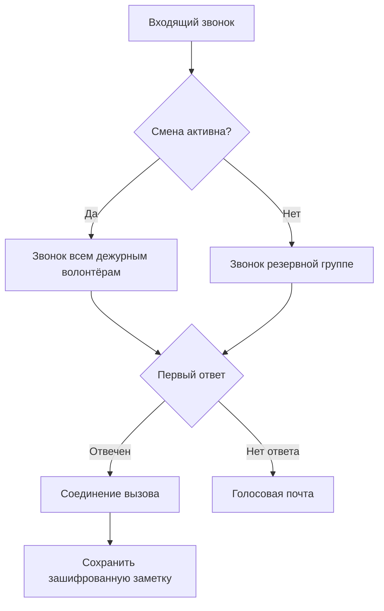

Запустите горячую линию Llamenos локально или на сервере. Нужен только Docker — Node.js, Bun или другие среды выполнения не требуются.

## Как это работает

Когда кто-то звонит на номер вашей горячей линии, Llamenos одновременно направляет вызов всем дежурным волонтёрам. Первый ответивший волонтёр подключается, а у остальных звонок прекращается. После завершения вызова волонтёр может сохранить зашифрованные заметки о разговоре.



То же самое относится к сообщениям SMS, WhatsApp и Signal — они отображаются в едином представлении **Разговоры**, где волонтёры могут отвечать.

## Предварительные требования

- [Docker](https://docs.docker.com/get-docker/) с Docker Compose v2
- `openssl` (предустановлен в большинстве систем Linux и macOS)
- Git

## Быстрый старт

```bash
git clone https://github.com/rhonda-rodododo/llamenos.git
cd llamenos
./scripts/docker-setup.sh
```

Это генерирует все необходимые секреты, собирает приложение и запускает сервисы. После завершения перейдите на **http://localhost:8000**, и мастер настройки проведёт вас через:

1. **Создание учётной записи администратора** — генерирует криптографическую пару ключей в вашем браузере
2. **Название горячей линии** — задайте отображаемое имя
3. **Выбор каналов** — включите Голос, SMS, WhatsApp, Signal и/или Отчёты
4. **Настройка провайдеров** — введите учётные данные для каждого включённого канала
5. **Проверка и завершение**

### Попробуйте демо-режим

Для изучения с предзаполненными примерами данных и входом в один клик (без создания учётной записи):

```bash
./scripts/docker-setup.sh --demo
```

## Развёртывание в продакшене

Для сервера с реальным доменом и автоматическим TLS:

```bash
./scripts/docker-setup.sh --domain hotline.yourorg.com --email admin@yourorg.com
```

Caddy автоматически получает TLS-сертификаты Let's Encrypt. Убедитесь, что порты 80 и 443 открыты. Флаг `--domain` активирует продакшен-оверлей Docker Compose, который добавляет TLS, ротацию логов и лимиты ресурсов.

Полную информацию об укреплении сервера, резервном копировании, мониторинге и дополнительных сервисах см. в [руководстве по развёртыванию Docker Compose](/docs/deploy-docker).

## Настройка вебхуков

После развёртывания направьте вебхуки вашего провайдера телефонии на URL вашего развёртывания:

| Вебхук | URL |
|--------|-----|
| Голос (входящий) | `https://your-domain/api/telephony/incoming` |
| Голос (статус) | `https://your-domain/api/telephony/status` |
| SMS | `https://your-domain/api/messaging/sms/webhook` |
| WhatsApp | `https://your-domain/api/messaging/whatsapp/webhook` |
| Signal | Настройте мост для перенаправления на `https://your-domain/api/messaging/signal/webhook` |

Для настройки конкретного провайдера: [Twilio](/docs/setup-twilio), [SignalWire](/docs/setup-signalwire), [Vonage](/docs/setup-vonage), [Plivo](/docs/setup-plivo), [Asterisk](/docs/setup-asterisk), [SMS](/docs/setup-sms), [WhatsApp](/docs/setup-whatsapp), [Signal](/docs/setup-signal).

## Следующие шаги

- [Развёртывание Docker Compose](/docs/deploy-docker) — полное руководство по продакшен-развёртыванию с резервным копированием и мониторингом
- [Руководство администратора](/docs/admin-guide) — добавление волонтёров, создание смен, настройка каналов и параметров
- [Руководство волонтёра](/docs/volunteer-guide) — поделитесь с вашими волонтёрами
- [Руководство репортёра](/docs/reporter-guide) — настройка роли репортёра для отправки зашифрованных отчётов
- [Провайдеры телефонии](/docs/telephony-providers) — сравнение голосовых провайдеров
- [Модель безопасности](/security) — понимание шифрования и модели угроз
