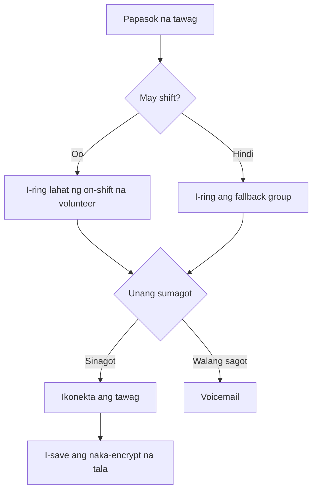

Patakbuhin ang isang Llamenos hotline nang lokal o sa isang server. Docker lang ang kailangan — hindi kailangan ng Node.js, Bun, o iba pang runtime.

## Paano ito gumagana

Kapag may tumawag sa numero ng iyong hotline, iruruta ng Llamenos ang tawag sa lahat ng on-shift na volunteer nang sabay-sabay. Ang unang volunteer na sumagot ay ikokonekta, at titigil ang pag-ring sa iba. Pagkatapos ng tawag, maaaring mag-save ang volunteer ng naka-encrypt na mga tala tungkol sa pag-uusap.



Pareho rin ito sa mga SMS, WhatsApp, at Signal na mensahe — lalabas ang mga ito sa pinag-isang **Conversations** view kung saan makakapag-reply ang mga volunteer.

## Mga kinakailangan

- [Docker](https://docs.docker.com/get-docker/) na may Docker Compose v2
- `openssl` (naka-install na sa karamihan ng Linux at macOS na sistema)
- Git

## Mabilis na pagsisimula

```bash
git clone https://github.com/rhonda-rodododo/llamenos.git
cd llamenos
./scripts/docker-setup.sh
```

Gagawa ito ng lahat ng kinakailangang secret, magbu-build ng application, at magsi-start ng mga serbisyo. Kapag tapos na, bisitahin ang **http://localhost:8000** at gagabayan ka ng setup wizard sa:

1. **Gumawa ng admin account** — magge-generate ng cryptographic keypair sa iyong browser
2. **Pangalanan ang iyong hotline** — itakda ang display name
3. **Pumili ng mga channel** — i-enable ang Voice, SMS, WhatsApp, Signal, at/o Reports
4. **I-configure ang mga provider** — ilagay ang mga credential para sa bawat naka-enable na channel
5. **Suriin at tapusin**

### Subukan ang demo mode

Para mag-explore gamit ang pre-seeded na sample data at one-click login (hindi kailangan gumawa ng account):

```bash
./scripts/docker-setup.sh --demo
```

## Production deployment

Para sa server na may totoong domain at automatic TLS:

```bash
./scripts/docker-setup.sh --domain hotline.yourorg.com --email admin@yourorg.com
```

Awtomatikong magpo-provision ang Caddy ng Let's Encrypt TLS certificate. Siguraduhin na bukas ang port 80 at 443. Ang `--domain` flag ay nag-a-activate ng production Docker Compose overlay, na nagdadagdag ng TLS, log rotation, at resource limit.

Tingnan ang [Docker Compose deployment guide](/docs/deploy-docker) para sa kumpletong detalye tungkol sa server hardening, backup, monitoring, at opsyonal na mga serbisyo.

## I-configure ang mga webhook

Pagkatapos mag-deploy, ituro ang mga webhook ng iyong telephony provider sa iyong deployment URL:

| Webhook | URL |
|---------|-----|
| Voice (papasok) | `https://your-domain/api/telephony/incoming` |
| Voice (status) | `https://your-domain/api/telephony/status` |
| SMS | `https://your-domain/api/messaging/sms/webhook` |
| WhatsApp | `https://your-domain/api/messaging/whatsapp/webhook` |
| Signal | I-configure ang bridge para mag-forward sa `https://your-domain/api/messaging/signal/webhook` |

Para sa provider-specific na setup: [Twilio](/docs/setup-twilio), [SignalWire](/docs/setup-signalwire), [Vonage](/docs/setup-vonage), [Plivo](/docs/setup-plivo), [Asterisk](/docs/setup-asterisk), [SMS](/docs/setup-sms), [WhatsApp](/docs/setup-whatsapp), [Signal](/docs/setup-signal).

## Mga susunod na hakbang

- [Docker Compose Deployment](/docs/deploy-docker) — kumpletong production deployment guide na may backup at monitoring
- [Admin Guide](/docs/admin-guide) — magdagdag ng mga volunteer, gumawa ng mga shift, i-configure ang mga channel at setting
- [Volunteer Guide](/docs/volunteer-guide) — ibahagi sa iyong mga volunteer
- [Reporter Guide](/docs/reporter-guide) — i-setup ang reporter role para sa naka-encrypt na report submission
- [Telephony Providers](/docs/telephony-providers) — ikumpara ang mga voice provider
- [Security Model](/security) — unawain ang encryption at threat model
