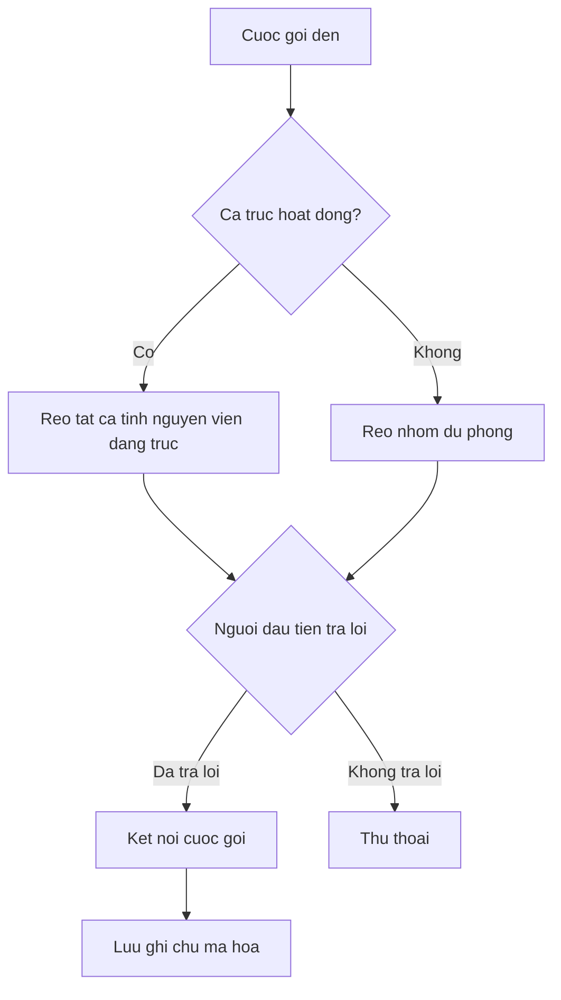

Chay duong day nong Llamenos tai may cuc bo hoac tren may chu. Chi can Docker — khong can Node.js, Bun hay bat ky runtime nao khac.

## Cach hoat dong

Khi ai do goi den so duong day nong cua ban, Llamenos dinh tuyen cuoc goi den tat ca tinh nguyen vien dang truc cung luc. Tinh nguyen vien dau tien tra loi se duoc ket noi, va nhung nguoi khac ngung reo. Sau cuoc goi, tinh nguyen vien co the luu ghi chu ma hoa ve cuoc tro chuyen.



Tuong tu voi tin nhan SMS, WhatsApp va Signal — chung hien thi trong giao dien **Hoi thoai** thong nhat noi tinh nguyen vien co the tra loi.

## Dieu kien tien quyet

- [Docker](https://docs.docker.com/get-docker/) voi Docker Compose v2
- `openssl` (da cai san tren hau het cac he thong Linux va macOS)
- Git

## Bat dau nhanh

```bash
git clone https://github.com/rhonda-rodododo/llamenos.git
cd llamenos
./scripts/docker-setup.sh
```

Lenh nay tao tat ca cac secret can thiet, build ung dung va khoi dong cac dich vu. Sau khi hoan tat, truy cap **http://localhost:8000** va trinh huong dan cai dat se dan ban qua:

1. **Tao tai khoan quan tri vien** — tao cap khoa mat ma trong trinh duyet cua ban
2. **Dat ten duong day nong** — thiet lap ten hien thi
3. **Chon kenh** — kich hoat Voice, SMS, WhatsApp, Signal va/hoac Bao cao
4. **Cau hinh nha cung cap** — nhap thong tin xac thuc cho tung kenh da kich hoat
5. **Xem lai va hoan tat**

### Thu che do demo

De kham pha voi du lieu mau va dang nhap mot cham (khong can tao tai khoan):

```bash
./scripts/docker-setup.sh --demo
```

## Trien khai san xuat

Cho may chu voi ten mien thuc va TLS tu dong:

```bash
./scripts/docker-setup.sh --domain hotline.yourorg.com --email admin@yourorg.com
```

Caddy tu dong cap chung chi TLS Let's Encrypt. Dam bao cong 80 va 443 da mo. Tuy chon `--domain` kich hoat lop san xuat Docker Compose, them TLS, xoay vong log va gioi han tai nguyen.

Xem [huong dan trien khai Docker Compose](/docs/deploy-docker) de biet chi tiet day du ve tang cuong bao mat may chu, sao luu, giam sat va cac dich vu tuy chon.

## Cau hinh webhook

Sau khi trien khai, tro webhook cua nha cung cap dien thoai den URL trien khai cua ban:

| Webhook | URL |
|---------|-----|
| Voice (den) | `https://your-domain/api/telephony/incoming` |
| Voice (trang thai) | `https://your-domain/api/telephony/status` |
| SMS | `https://your-domain/api/messaging/sms/webhook` |
| WhatsApp | `https://your-domain/api/messaging/whatsapp/webhook` |
| Signal | Cau hinh bridge chuyen tiep den `https://your-domain/api/messaging/signal/webhook` |

Cau hinh theo nha cung cap: [Twilio](/docs/setup-twilio), [SignalWire](/docs/setup-signalwire), [Vonage](/docs/setup-vonage), [Plivo](/docs/setup-plivo), [Asterisk](/docs/setup-asterisk), [SMS](/docs/setup-sms), [WhatsApp](/docs/setup-whatsapp), [Signal](/docs/setup-signal).

## Buoc tiep theo

- [Trien khai Docker Compose](/docs/deploy-docker) — huong dan trien khai san xuat day du voi sao luu va giam sat
- [Huong dan Quan tri vien](/docs/admin-guide) — them tinh nguyen vien, tao ca truc, cau hinh kenh va cai dat
- [Huong dan Tinh nguyen vien](/docs/volunteer-guide) — chia se voi tinh nguyen vien cua ban
- [Huong dan Phong vien](/docs/reporter-guide) — thiet lap vai tro phong vien de gui bao cao ma hoa
- [Nha cung cap Dien thoai](/docs/telephony-providers) — so sanh cac nha cung cap voice
- [Mo hinh Bao mat](/security) — tim hieu ve ma hoa va mo hinh de doa
