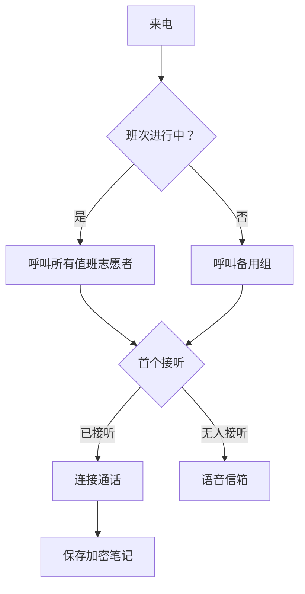

在本地或服务器上运行 Llamenos 热线。只需要 Docker — 无需 Node.js、Bun 或其他运行时。

## 工作原理

当有人拨打您的热线号码时，Llamenos 会同时将电话转接给所有值班志愿者。第一个接听的志愿者将被连接，其他人停止响铃。通话结束后，志愿者可以保存关于对话的加密笔记。



SMS、WhatsApp 和 Signal 消息同样适用 — 它们显示在统一的**对话**视图中，志愿者可以在此回复。

## 前提条件

- [Docker](https://docs.docker.com/get-docker/) 及 Docker Compose v2
- `openssl`（大多数 Linux 和 macOS 系统已预装）
- Git

## 快速开始

```bash
git clone https://github.com/rhonda-rodododo/llamenos.git
cd llamenos
./scripts/docker-setup.sh
```

此命令会生成所有必需的密钥、构建应用程序并启动服务。完成后，访问 **http://localhost:8000**，设置向导将引导您完成：

1. **创建管理员账户** — 在浏览器中生成加密密钥对
2. **命名您的热线** — 设置显示名称
3. **选择渠道** — 启用语音、SMS、WhatsApp、Signal 和/或报告
4. **配置提供商** — 输入每个已启用渠道的凭证
5. **审核并完成**

### 试用演示模式

使用预填充的示例数据和一键登录进行探索（无需创建账户）：

```bash
./scripts/docker-setup.sh --demo
```

## 生产部署

对于拥有真实域名和自动 TLS 的服务器：

```bash
./scripts/docker-setup.sh --domain hotline.yourorg.com --email admin@yourorg.com
```

Caddy 会自动配置 Let's Encrypt TLS 证书。确保端口 80 和 443 已开放。`--domain` 选项激活 Docker Compose 生产层，添加 TLS、日志轮转和资源限制。

有关服务器加固、备份、监控和可选服务的完整详情，请参阅 [Docker Compose 部署指南](/docs/deploy-docker)。

## 配置 Webhook

部署后，将您的电话提供商的 webhook 指向您的部署 URL：

| Webhook | URL |
|---------|-----|
| 语音（来电） | `https://your-domain/api/telephony/incoming` |
| 语音（状态） | `https://your-domain/api/telephony/status` |
| SMS | `https://your-domain/api/messaging/sms/webhook` |
| WhatsApp | `https://your-domain/api/messaging/whatsapp/webhook` |
| Signal | 配置桥接转发至 `https://your-domain/api/messaging/signal/webhook` |

各提供商的具体设置：[Twilio](/docs/setup-twilio)、[SignalWire](/docs/setup-signalwire)、[Vonage](/docs/setup-vonage)、[Plivo](/docs/setup-plivo)、[Asterisk](/docs/setup-asterisk)、[SMS](/docs/setup-sms)、[WhatsApp](/docs/setup-whatsapp)、[Signal](/docs/setup-signal)。

## 后续步骤

- [Docker Compose 部署](/docs/deploy-docker) — 包含备份和监控的完整生产部署指南
- [管理员指南](/docs/admin-guide) — 添加志愿者、创建班次、配置渠道和设置
- [志愿者指南](/docs/volunteer-guide) — 与您的志愿者分享
- [报告员指南](/docs/reporter-guide) — 设置报告员角色以提交加密报告
- [电话提供商](/docs/telephony-providers) — 比较语音提供商
- [安全模型](/security) — 了解加密和威胁模型
